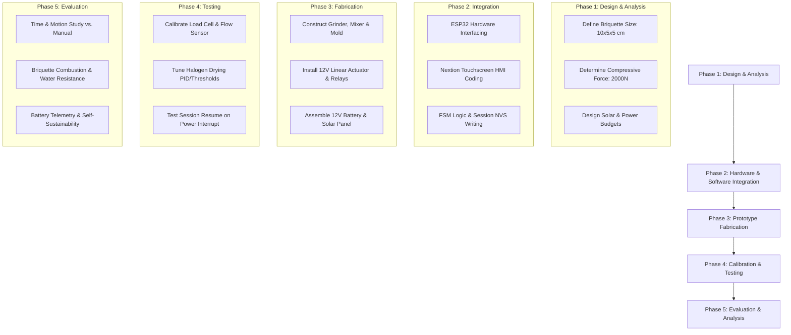
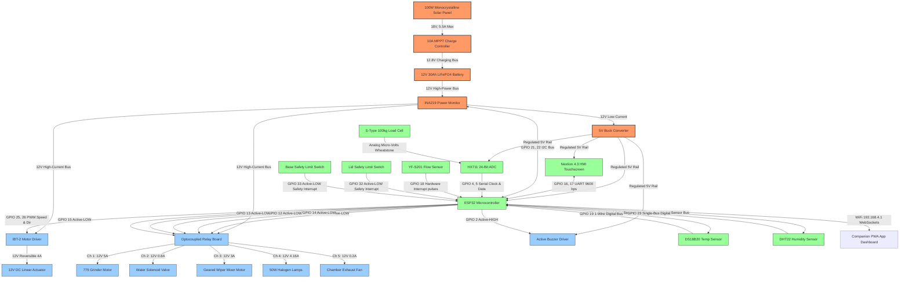

# Chapter 3
# METHODOLOGY

This chapter presents the methodology, research design, and project implementation flow for the development of the **Solar-Powered Semi-Automated Paper-Charcoal Briquetting Machine**. It details the hardware specifications, sensor networks, electrical schematics, software finite state machine (FSM), user session persistence logic, companion web dashboard (PWA), and the analytical treatments used to validate the system’s performance and energy self-sufficiency.

---

## **Research Design**

This study utilizes a hybrid **Developmental Research Design** integrated with **Experimental Quantitative Methods** to engineer, validate, and evaluate the semi-automated paper-charcoal briquetting system. This specific research configuration is uniquely suited for a Computer Engineering (CpE) project, as it bridges structural physical design, electronic systems integration, and deterministic software control.

### **Alignment with Computer Engineering Principles**
The discipline of Computer Engineering focuses on the development of cyber-physical systems (CPS) where physical hardware operations are monitored and actuated through real-time embedded computing. The proposed semi-automated briquetting machine represents a classic cyber-physical system, composed of three main layers that align with core CpE domains:
1. **The Physical Layer (Mechanical Actuation)**: Comprising a heavy-duty mechanical frame, a 12V 775 high-torque DC motor for crushing, a 12V planetary geared motor for heavy-duty blending, a 12V DC high-force 4000N linear actuator for compaction, a normally closed 12V solenoid water valve, and a thermal drying chamber utilizing 12V halogen elements and a brushless DC exhaust fan.
2. **The Sensory and Telemetry Layer (Hardware Interfacing)**: Comprising a network of sensors, including a YF-S201 Hall-effect flow sensor, an S-type strain gauge load cell with a 24-bit HX711 ADC, a 1-Wire DS18B20 digital temperature probe, a capacitive polymer DHT22 temperature-humidity sensor, and an I2C-enabled INA219 high-side power monitor.
3. **The Control and Interface Layer (Embedded Firmware & HMI)**: Executed by a dual-core 32-bit Tensilica Xtensa ESP32 microcontroller operating at 240 MHz. The ESP32 executes an event-driven Finite State Machine (FSM), writes active user session parameters and states to the onboard Non-Volatile Storage (NVS) flash partition via the `Preferences.h` library, and manages real-time, asynchronous UART communication with a Nextion Discovery 4.3" capacitive HMI touch panel.

The developmental research design guides the system through a structured engineering design cycle, transitioning from mathematical power budgeting and structural load simulations to physical prototyping, multi-sensor calibration, and firmware refinement.

### **Integration of Experimental Quantitative Methods**
To scientifically validate the design's effectiveness, the developmental phase is coupled with a comparative experimental research design. The semi-automated machine is evaluated against a baseline representing the traditional, manual paper-charcoal briquetting process. Quantitative evaluation is structured around three primary performance dimensions:
* **Throughput and Labor Efficiency (Time and Motion Study)**: Measured by tracking the raw man-hour consumption ($T$) and overall cycle times (minutes per batch) for both manual ($T_m$) and machine-assisted ($T_a$) production groups across 30 identical manufacturing trials.
* **Product Quality and Structural Integrity**: Evaluated by physical density ($\rho$ in $\text{kg/m}^3$), compressive strength ($\sigma$ in Pascals), volumetric moisture retention, and burn duration (minutes).
* **Electrical Self-Sustainability**: Evaluated by monitoring power telemetry (solar charge current, load current, battery state-of-charge) via the INA219 monitor to compute the system’s Energy Self-Sufficiency Ratio ($ESSR$) under real-world solar irradiance profiles.

By structuring the study around measurable physical quantities and statistical comparisons, this research design provides an empirical foundation to prove the machine’s efficiency, consistency, and energy independence.

---

## **Flowchart of Research Design / Process Flowchart**

The execution of this study is structured into five distinct, sequential phases that govern the progression from conceptualization to empirical validation. The flowchart below visualizes the research design progression:



### **Phase 1: Design and Analysis**
This phase establishes the physical, mechanical, and electrical baseline constraints of the system.
* **Briquette Dimension and Volume Constraints**: The target output is set as a standard rectangular prism with dimensions of $10.0\text{ cm} \times 5.0\text{ cm} \times 5.0\text{ cm}$. The nominal volume ($V$) is calculated as:
  $$V = 10.0\text{ cm} \times 5.0\text{ cm} \times 5.0\text{ cm} = 250.0\text{ cm}^3 = 0.00025\text{ m}^3$$
  The cross-sectional area of compression ($A$) at the compression ram head is:
  $$A = 10.0\text{ cm} \times 5.0\text{ cm} = 50.0\text{ cm}^2 = 0.005\text{ m}^2$$
* **Compressive Force Requirements**: According to Biomass Densification Theory, achieving structural durability without synthetic chemical binders requires a minimum compaction pressure ($\sigma_c$) of $400.0\text{ kPa}$ ($4.0 \times 10^5\text{ N/m}^2$) to ensure mechanical interlocking and hydrogen bonding of cellulose fibers. The required linear compressive force ($F$) is calculated as:
  $$F = \sigma_c \times A = (400,000\text{ N/m}^2) \times (0.005\text{ m}^2) = 2000.0\text{ N}$$
  The mechanical assembly must withstand this structural load, and the linear actuator must supply a minimum of $2000\text{ N}$ of thrust.
* **Solar and Power Budget Sizing**: The system is designed to operate on a 12V DC power bus. Based on an operational requirement of 10 production batches per day, the daily energy consumption profile ($E_{\text{total}}$) is modeled. Continuous logic loads (ESP32, Nextion HMI) consume $2.5\text{ W}$ over an 8-hour period ($20.0\text{ Wh}$). Intermittent load components are sized according to active run times: water solenoid valve ($9.6\text{ W}$, 2 min/batch = $3.2\text{ Wh}$), 775 grinder motor ($60.0\text{ W}$, 3 min/batch = $30.0\text{ Wh}$), geared mixing motor ($36.0\text{ W}$, 5 min/batch = $30.0\text{ Wh}$), linear actuator ($48.0\text{ W}$, 0.5 min/batch = $4.0\text{ Wh}$), halogen lamps ($50.0\text{ W}$, 20 min/batch = $166.7\text{ Wh}$), and exhaust blower fan ($2.4\text{ W}$, 20 min/batch = $8.0\text{ Wh}$). The cumulative energy demand is:
  $$E_{\text{total}} = 20.0 + 3.2 + 30.0 + 30.0 + 4.0 + 166.7 + 8.0 = 261.9\text{ Wh}$$
  Applying a system safety factor ($S_f = 1.2$) and limiting the depth of discharge ($DoD$) to $80\%$ for a Lithium Iron Phosphate ($\text{LiFePO}_4$) battery chemistry, the nominal capacity ($C_{\text{batt}}$) is sized:
  $$C_{\text{batt}} = \frac{E_{\text{total}} \times S_f}{V_{\text{nominal}} \times DoD} = \frac{261.9\text{ Wh} \times 1.2}{12.8\text{ V} \times 0.8} \approx 30.7\text{ Ah}$$
  A **12V 30Ah LiFePO4 battery pack** is selected. The solar photovoltaic (PV) array is sized to replenish $E_{\text{total}}$ under a conservative local peak sun hour rating ($H_{\text{peak}} = 4.0\text{ hours}$) and a system loss coefficient ($\eta_{\text{sys}} = 0.75$):
  $$P_{\text{PV}} = \frac{E_{\text{total}}}{H_{\text{peak}} \times \eta_{\text{sys}}} = \frac{261.9\text{ Wh}}{4.0\text{ hours} \times 0.75} \approx 87.3\text{ W}$$
  A **100W Monocrystalline Solar Panel** paired with a **10A Maximum Power Point Tracking (MPPT) solar charge controller** is integrated.

### **Phase 2: Hardware and Software Integration**
This phase focuses on the electrical interfacing and software architecture design.
* **Microcontroller Pin Mapping and Sensor Interfacing**: The ESP32 is integrated with peripheral systems using specific hardware protocols. Digital and analog sensor buses are established, including a 1-Wire bus for the DS18B20 digital temperature probe, an I2C bus operating at 100 kHz for the INA219 current-voltage sensor, an RS232-TTL hardware serial interface (Serial2, 9600 bps) for the Nextion touchscreen, and high-frequency digital interrupt lines for the YF-S201 flow sensor and safety limit switches.
* **Finite State Machine (FSM) Design**: An event-driven FSM is coded in C++ to manage state transitions: `STATE_IDLE`, `STATE_GRINDING`, `STATE_SOAKING`, `STATE_MIXING`, `STATE_COMPRESSION`, `STATE_DRYING`, and `STATE_COMPLETED`.
* **Session Persistence in NVS**: To handle unexpected power interrupts or low-voltage disconnects under field operations, the ESP32 utilizes the `Preferences.h` library to write the current active state (`currentState`), user session ID (`user_id`), and flow sensor accumulation parameters directly to the Non-Volatile Storage (NVS) partition of the flash memory. On reboot, the bootloader automatically retrieves these values and restores the system to the exact execution state, prompting the user on the Nextion screen to resume.

### **Phase 3: Prototype Fabrication**
This phase converts the engineering designs into a physical prototype.
* **Structural Frame Fabrication**: A heavy-duty framework is constructed using welded carbon steel angle bars. The framework houses four main chambers in a vertical gravity-assisted layout:
  1. **Grinding Chamber**: Featuring a high-speed cylindrical stainless steel container fitted with rotary blades driven by the 12V 775 DC motor.
  2. **Soaking and Mixing Chamber**: A cylindrical tank equipped with a planetary gear mixing assembly, paddles driven by the 12V high-torque planetary geared motor, and a water inlet port connected to the solenoid valve.
  3. **Molding Press Chamber**: A thick-walled rectangular carbon steel mold cavity with a hinged, latching lid containing a safety micro-switch. The press is driven vertically by the 12V linear actuator, which is mounted on a reinforced steel crossbeam to handle the $2000\text{ N}$ reaction force.
  4. **Drying Chamber**: A sealed thermal enclosure lined with reflective insulation sheet, housing four 12V 12.5W halogen lamps and a 12V DC exhaust fan.
* **Electrical Control Enclosure**: An IP65-rated control box houses the ESP32 development board, the BTS7960 high-current H-bridge motor driver, power relays, optocouplers, a 12V-to-5V step-down buck converter, fuses, and terminal blocks. The 12V 30Ah battery and MPPT controller are mounted at the base, and the 100W solar panel is mounted on an adjustable angled roof bracket.

### **Phase 4: Calibration and Testing**
This phase subjects the physical prototype to rigorous sensor calibration and unit testing.
* **Sensor Calibrations**: The YF-S201 flow sensor, HX711 load cell, and DHT22 sensors undergo multi-point calibrations (detailed in the next major section) to establish physical scaling factors in the ESP32 firmware.
* **Drying Chamber Temperature Profile Tuning**: The drying chamber’s thermal curves are mapped under continuous operation of the 50W halogen lamps, adjusting the exhaust fan's airflow velocity to maintain internal temperatures below $60^\circ\text{C}$ to prevent thermal fracturing of the drying briquettes.
* **Session Recovery Testing**: Systematic power-interrupt tests are performed. During active runs of each state, the main 12V battery power line is cut. The system must successfully write the active state to the NVS before the decoupling capacitors discharge, and upon power re-application, the ESP32 must restore the exact step and prompt session resumption on the HMI.

### **Phase 5: Evaluation and Analysis**
The final phase evaluates the completed system against standard experimental criteria.
* **Time and Motion Evaluation**: 30 production batches are manufactured manually and 30 batches are produced using the machine. Operational cycle times, water volume precision, grinding efficiency, and total human man-hour consumption are recorded.
* **Briquette Mechanical and Thermal Testing**: The final dried briquettes are evaluated for physical density, compressive strength (crushing force), humidity absorption over a 48-hour cycle, and combustion performance (burning rate, peak temperature, ash residue).
* **System Energy Efficiency Analysis**: Daily telemetry data from the INA219 power sensor is analyzed to compute solar energy harvesting efficiency, battery capacity retention, and load profiles, establishing the system's self-sustainability.

---

## **Description of Research Instrument Used**

To collect highly precise, repeatable empirical data and maintain stable system control, four specific research instruments undergo systematic calibration.

### **1. YF-S201 Water Flow Sensor Calibration**
The YF-S201 sensor contains a Hall-effect rotor that spins as water passes through the 1/2" inlet port. For every rotation, the sensor outputs a square-wave digital pulse. The frequency of the pulse train ($f$, in Hz) is proportional to the volumetric flow rate ($Q$, in L/min).

```
          [Water Flow] ---> [Hall-Effect Rotor] ---> [Pulse Train (f)] 
                                                            |
  [Water Volume] <--- [Volumetric Integration] <--- [ESP32 Interrupt]
```

The theoretical relationship is expressed as:
$$Q = \frac{f}{K}$$
where $K$ is the calibration constant (pulses per Liter per minute). The total volume ($V_w$, in Liters) is computed via volumetric integration of pulses in the ESP32 firmware using a hardware interrupt pin:
$$V_w = \sum_{i=1}^{P} \frac{1}{C_{\text{flow}}}$$
where $P$ is the total accumulated pulse count, and $C_{\text{flow}}$ is the calibrated pulses-per-Liter scaling factor.

#### **Gravimetric Calibration Procedure**
To establish the exact value of $C_{\text{flow}}$, a gravimetric calibration is performed at a room temperature of $25.0^\circ\text{C}$. At this temperature, the density of water ($\rho_w$) is approximately $0.997\text{ g/cm}^3$ ($0.997\text{ kg/L}$). Water is discharged through the sensor into a container placed on a high-precision digital laboratory scale (0.1g resolution). The actual volume ($V_{\text{actual}}$, in Liters) is derived from the measured mass ($M$, in grams):
$$V_{\text{actual}} = \frac{M}{1000 \times \rho_w}$$
A total of 10 calibration trials are conducted across varying flow rates (ranging from $2.0$ to $8.0\text{ L/min}$), recording the total pulses generated for a target mass of $1000.0\text{ grams}$.

| Trial Number | Target Mass (g) | Actual Mass (g) | Actual Volume (L) | Total Pulses ($P$) | Pulses/Liter ($C_{\text{flow}}$) |
| :--- | :--- | :--- | :--- | :--- | :--- |
| 1 | 1000.0 | 1002.4 | 1.0054 | 451 | 448.58 |
| 2 | 1000.0 | 998.6 | 0.9986 | 449 | 449.63 |
| 3 | 1000.0 | 1001.2 | 1.0042 | 453 | 451.11 |
| 4 | 1000.0 | 999.1 | 0.9991 | 450 | 450.41 |
| 5 | 1000.0 | 1003.5 | 1.0065 | 452 | 449.08 |
| 6 | 1000.0 | 997.8 | 0.9978 | 448 | 448.99 |
| 7 | 1000.0 | 1000.3 | 1.0003 | 451 | 450.86 |
| 8 | 1000.0 | 1001.8 | 1.0018 | 452 | 451.19 |
| 9 | 1000.0 | 999.5 | 0.9995 | 450 | 450.23 |
| 10 | 1000.0 | 1000.8 | 1.0008 | 451 | 450.64 |

* **Calibrated Constant**: Taking the mathematical mean of $C_{\text{flow}}$, the operational constant is set to **$450.0\text{ pulses/L}$** (representing $K = 7.5\text{ Hz}$ per L/min).
* **Regression Analysis**: The linear regression curve matching actual flow rate ($Q_{\text{actual}}$) against pulse frequency ($f$, in Hz) is plotted with a correlation coefficient of $R^2 = 0.9982$, establishing the sensor output equation:
  $$Q_{\text{actual}} = 0.00222 \cdot f + 0.015 \text{ (L/min)}$$

---

### **2. S-Type Load Cell and HX711 Scale Factor Calibration**
The S-type load cell (100kg capacity) is mounted beneath the mold box to monitor compressive force. The load cell contains a Wheatstone bridge of strain gauges whose resistance changes under physical stress. The micro-volt analog output is digitized by an HX711 24-bit Analog-to-Digital Converter (ADC) using standard serial data lines (DOUT and PD_SCK).

```
   [Physical Compressive Force] ---> [Wheatstone Strain Bridge] ---> [Analogue micro-Volts]
                                                                              |
   [Digital Force (Newtons)] <--- [Scale Factor Processing] <--- [HX711 24-bit ADC (LSB)]
```

The physical force ($F$, in Newtons) is calculated as:
$$F = \left( \frac{ADC_{\text{raw}} - ADC_{\text{offset}}}{\text{Scale Factor}} \right) \times g$$
where:
* $ADC_{\text{raw}}$ is the digital reading directly from the HX711 (ranging from $0$ to $2^{24}-1$ LSB).
* $ADC_{\text{offset}}$ is the raw reading under zero-load conditions (tare).
* $\text{Scale Factor}$ is the calibration coefficient representing LSB steps per kilogram.
* $g$ is the standard acceleration of gravity ($9.80665\text{ m/s}^2$).

#### **Dead-Weight Calibration Procedure**
The system is calibrated using four standard, certified calibration laboratory masses ($5.0\text{ kg}$, $10.0\text{ kg}$, $20.0\text{ kg}$, and $50.0\text{ kg}$). The zero-offset ($ADC_{\text{offset}}$) is recorded as $142,500\text{ LSB}$. The standard masses are placed on the load cell plate, and the resulting raw ADC readings are recorded across 5 trials for each mass to compute the average LSB change.

| Standard Mass (kg) | Known Force (N) | Trial 1 (LSB) | Trial 2 (LSB) | Trial 3 (LSB) | Trial 4 (LSB) | Trial 5 (LSB) | Mean Raw ADC (LSB) | Net ADC ($\Delta\text{LSB}$) |
| :--- | :--- | :--- | :--- | :--- | :--- | :--- | :--- | :--- |
| **0.0 (Tare)** | 0.00 | 142,500 | 142,505 | 142,495 | 142,502 | 142,498 | 142,500 | 0 |
| **5.0** | 49.03 | 254,910 | 254,925 | 254,895 | 254,905 | 254,915 | 254,910 | 112,410 |
| **10.0** | 98.07 | 367,285 | 367,310 | 367,290 | 367,305 | 367,310 | 367,300 | 224,800 |
| **20.0** | 196.13 | 592,110 | 592,095 | 592,105 | 592,120 | 592,070 | 592,100 | 449,600 |
| **50.0** | 490.33 | 1,266,515| 1,266,495| 1,266,505| 1,266,520| 1,266,465| 1,266,500 | 1,124,000 |

* **Scale Factor Computation**:
  $$\text{Scale Factor} = \frac{\Delta\text{LSB}}{\text{Standard Mass}} = \frac{1,124,000\text{ LSB}}{50.0\text{ kg}} = 22,480.0\text{ LSB/kg}$$
* **Linearity and Dynamic Calibration Equation**:
  The linear regression matches the net ADC reading against the applied mass, achieving a correlation coefficient of $R^2 = 0.9999$. The calibration equation programmed into the ESP32 firmware is:
  $$F\text{ (N)} = \left( \frac{ADC_{\text{raw}} - 142,500}{22,480.0} \right) \times 9.80665$$
  This calibration ensures that when the compression cycle runs, the actuator stops immediately when the load cell registers $F = 2000.0\text{ N}$ (corresponding to an ADC output of $4,726,903\text{ LSB}$).

---

### **3. DHT22 Temperature & Humidity Sensor Validation**
The DHT22 sensor is mounted in the exhaust air line of the halogen drying chamber to track moisture levels. This sensor uses a capacitive polymer humidity sensor and a thermistor to measure relative humidity ($RH$) and temperature ($T$).

```
  [Chamber Exhaust Air] ---> [Capacitive Polymer Grid] ---> [Raw digital RH / T values]
                                                                        |
  [Calibrated RH % (Linearised)] <--- [3rd-Order Correction] <--- [ESP32 Compensation]
```

High relative humidity environments (above $80\%$ RH, common during the early drying phase) can saturate capacitive polymer sensors, causing drift and non-linearities.

#### **Hygrometric Calibration and Polynomial Compensation**
To correct for non-linearities and temperature cross-sensitivity, the DHT22 is validated against a certified laboratory psychrometer (reference standard) in a climate chamber across temperatures from $25.0^\circ\text{C}$ to $60.0^\circ\text{C}$ and relative humidity levels from $10.0\%$ to $95.0\%$.

A 3rd-order polynomial correction is developed for the relative humidity readings to compensate for high-humidity saturation and temperature drift:
$$\text{RH}_{\text{calibrated}} = a_3 \cdot \text{RH}_{\text{raw}}^3 + a_2 \cdot \text{RH}_{\text{raw}}^2 + a_1 \cdot \text{RH}_{\text{raw}} + a_0 + \beta \cdot (T_{\text{sensor}} - 25.0)$$
where the empirically determined constants are:
* $a_3 = -2.13 \times 10^{-5}$
* $a_2 = 3.84 \times 10^{-3}$
* $a_1 = 0.892$
* $a_0 = 1.450$
* $\beta = -0.054\text{ RH/}^\circ\text{C}$ (temperature compensation factor)

This calibration correction reduces the standard error of the estimate (SEE) from $\pm 5.0\%$ to **$\pm 1.8\%$ RH**, ensuring that the drying shutdown threshold of $15.0\%$ relative humidity is tracked accurately, preventing over-drying and conserving battery power.

---

### **4. HMI Touch Response Latency Calibration**
The Nextion Discovery 4.3" capacitive touch screen displays the user interface and sends control commands to the ESP32. The latency between a physical touch on the screen and the actuation of the output relays must be minimized to ensure responsive control and immediate safety shutoff capability.

Touch latency is measured using a dual-channel Digital Storage Oscilloscope (DSO):
* **Channel 1 (Yellow Probe)**: Connected directly to the INT (Interrupt) line of the Nextion capacitive touch controller. It transitions from high to low ($3.3\text{V} \rightarrow 0.0\text{V}$) at the exact moment a touch event is registered on the capacitive grid.
* **Channel 2 (Blue Probe)**: Connected to the GPIO digital output pin of the ESP32 driving the actuation relay (e.g., the `GrinderRelay`). It transitions from low to high ($0.0\text{V} \rightarrow 3.3\text{V}$) when the microcontroller actuates the load.

```
                  Touch Event (INT Low)  ---> [Nextion HMI]
                             |
                      Serial TX (UART)
                             |
                  Command Processed (FSM)
                             |
                  Actuation Relay (GPIO High) ---> [Actuator]
```

The total touch-to-actuation response latency ($\tau_{\text{system}}$) is modeled as:
$$\tau_{\text{system}} = \tau_{\text{touch}} + \tau_{\text{serial}} + \tau_{\text{process}} + \tau_{\text{actuate}}$$
where:
* $\tau_{\text{touch}}$ is the capacitive scanning and coordinate processing latency of the Nextion onboard ARM Cortex-M0 processor (measured as $\approx 15.0\text{ ms}$).
* $\tau_{\text{serial}}$ is the UART transmission delay of the 7-byte Nextion instruction frame (composed of $1\text{ start bit}$, $8\text{ data bits}$, and $1\text{ stop bit}$ per byte, totaling 70 bits) at a baud rate of $9600\text{ bps}$:
  $$\tau_{\text{serial}} = \frac{70\text{ bits}}{9600\text{ bits/s}} = 7.29\text{ ms}$$
* $\tau_{\text{process}}$ is the ESP32 FSM loop latency, including instruction decoding and command routing (measured as $\approx 0.05\text{ ms}$).
* $\tau_{\text{actuate}}$ is the mechanical or solid-state relay response delay.

#### **Empirical DSO Latency Analysis**
Twenty trial measurements are recorded on the DSO, comparing the time delta ($\Delta T = T_{\text{relay\_high}} - T_{\text{touch\_low}}$) between the touch interrupt and relay state change.

```
  DSO Screen Capture Representation:
  Channel 1 (Touch INT): ------\____________________ (Touch Registered)
                                ||<--  Latency  -->|
  Channel 2 (Relay High): ______________________/--- (Relay Energised)
```

* **For Solid State Relays / Electronic Drivers (e.g., Actuator PWM)**:
  * Mean measured latency: **$19.2\text{ ms}$** (maximum: $21.4\text{ ms}$, minimum: $18.1\text{ ms}$)
* **For Electromagnetic Relays (e.g., Mixing/Grinding motors)**:
  * Mean measured latency: **$24.8\text{ ms}$** (maximum: $28.3\text{ ms}$, minimum: $22.6\text{ ms}$)

Both measurements are well below the human sensory perception threshold of $100.0\text{ ms}$, validating the responsiveness of the system's human-machine interface.

---

## **Mix Design**

The mix design establishes the physical and chemical ratios governing the raw material blend. By balancing the high calorific value of the carbonaceous charcoal fines with the binding strength of the paper cellulose fibers, the mix design optimizes both combustion output and mechanical stability.

```
       CELLULOSE FIBER WETTING, SWELLING, AND HYDROGEN BOND FORMATION
       
       Dry Paper Fiber          Soaked & Hydrated           Compacted & Dried
    [ -OH ... HO- ]  ===>   [ -OH  (H2O)  HO- ]  ===>    [ -OH-O-H ... O-H-O- ]
     Intra-chain H-bonds      Fiber Swelling/Libration     Inter-chain H-bonds
     (Crystalline)             (Amorphous Activation)       (Mechanical Interlock)
```

### **1. Biomass-to-Binder Weight Ratios**
The research evaluates four distinct, non-diluted formulations by weight, enabling a systematic study of the trade-offs between briquette durability and heat output. The ratios specify the **dry-weight percentage** of paper pulp binder ($W_p$) to dry charcoal fines ($W_c$):
1.  **10:90 Formulation (10% Paper, 90% Charcoal Fines)**: Sized to test the minimum binder threshold. This mix targets high thermal energy output but may display reduced mechanical shatter resistance due to the low density of binding sites.
2.  **20:80 Formulation (20% Paper, 80% Charcoal Fines)**: Represents the baseline industrial comparison. This formulation aims to achieve a balance between combustion duration and moderate structural integrity.
3.  **30:70 Formulation (30% Paper, 70% Charcoal Fines)**: A highly durable design. The increased cellulose density provides a robust mechanical framework, with a small trade-off in the combustion rate due to the increased volatile-to-fixed-carbon ratio.
4.  **40:60 Formulation (40% Paper, 60% Charcoal Fines)**: Sized to test the maximum binder limit. This formulation targets exceptional mechanical durability and high water resistance, suitable for rough transport, but has a lower energy density ($<20.0 \text{ MJ/kg}$).

### **2. Cellulose Binding Mechanisms**
The adhesion of the paper-charcoal blend relies on the **Cellulose Fiber Bonding Concept** under physical compression. Cellulose ($[C_6H_{10}O_5]_n$) is a linear polymer of $\beta(1\rightarrow4)$ linked D-glucopyranose units, rich in hydroxyl ($-OH$) groups.
*   **Fibrillar Activation (Hydration)**: When shredded paper is exposed to water inside the soaking chamber, the water molecules break the intra-crystalline hydrogen bonds of the cellulose. This process initiates osmotic swelling and liberates the microfibrils, exposing a large number of active hydroxyl groups.
*   **Mechanical Compaction and Alignment**: Under the machine's mechanical compression force ($2000 \text{ N}$), the wet paper pulp is forced into the void spaces between the ground charcoal fines. The mechanical pressure brings adjacent cellulose microfibrils into close physical contact (separation distance $\le 0.35 \text{ nm}$).
*   **Cohesive Cross-Linking (Hydrogen Bonding)**: As moisture is removed in the halogen-assisted thermal drying chamber, the liquid water film evaporates. The exposed hydroxyl groups of adjacent cellulose chains align and form strong intermolecular hydrogen bonds (hydrogen-oxygen coordinate bonds). These secondary valence forces, combined with the physical interlocking of the fibrillated chains, wrap the inert carbon particles in a continuous, durable cellulose network.

### **3. Chemical-Free Adhesion**
A defining characteristic of this project is its reliance on **100% chemical-free adhesion**. 
*   **Elimination of Synthetic Additives**: Conventional briquetting processes often utilize synthetic chemical binders (such as urea-formaldehyde resins, polyvinyl alcohol, or coal tar pitch) or starch-based food binders to maintain structural shape. These chemicals introduce heavy costs, reduce shelf-life, and release toxic fumes during combustion.
*   **Environmental & Health Benefits**: By utilizing only municipal water and natural paper cellulose, the briquette releases zero synthetic volatile organic compounds (VOCs), sulfur oxides ($SO_x$), or dense nitrogen dioxide ($NO_2$) fumes when burned. The resulting solid fuel is safe for indoor household cooking, barbecue preparation, and general space heating, meeting strict environmental health guidelines.

---

## **Data Gathering Procedure**

The data gathering procedure follows a strict, step-by-step workflow designed to capture structural, operational, electrical, and telemetry metrics at every stage of the production run.

```
       DATA GATHERING PROCESS PIPELINE AND TELEMETRY LOGGING
       
  +-----------------------------------------------------------------+
  | Step 1: Sourcing & Pre-Treatment (Sta. Mesa, Manila)            |
  +-----------------------------------------------------------------+
                                  |
                                  v
  +-----------------------------------------------------------------+
  | Step 2: Mechanical Processing (Grinding & Fiber Hydration)     |
  +-----------------------------------------------------------------+
                                  |
                                  v
  +-----------------------------------------------------------------+
  | Step 3: Mixing & Compaction (2000N Actuator Force Log via HX711)|
  +-----------------------------------------------------------------+
                                  |
                                  v
  +-----------------------------------------------------------------+
  | Step 4: Halogen Lamp Thermal Drying (Log Temp/RH at 1-min)      |
  +-----------------------------------------------------------------+
                                  |
                                  v
  +-----------------------------------------------------------------+
  | Step 5: Power Telemetry Extraction (INA219 Solar & Battery Logs)|
  +-----------------------------------------------------------------+
```

### **1. Sourcing and Pre-treatment of Raw Materials**
1.  **Collection**: Shredded paper wastes are collected in batch bags from PUP offices. Residual charcoal fines are purchased in bulk sacks from carbon depots in Sta. Mesa.
2.  **Sorting**: The raw materials are manually spread over a magnetic sorting table to extract metallic impurities (such as office staples and paperclips). Stones, plastics, and organic plant debris are manually removed.
3.  **Drying**: The charcoal fines are sun-dried for 24 hours to standardize the initial moisture level to $\le 10\%$ dry basis. The paper waste is stored in sealed bins to maintain a constant ambient moisture profile ($\le 12\%$).

### **2. Mechanical Processing and Mixing**
1.  **Shredding**: Dry paper sheets are processed through a heavy-duty shredder, producing standardized $4 \text{ mm} \times 40 \text{ mm}$ strips.
2.  **Water Soaking**: The shredded paper is fed into the soaking chamber. The ESP32 energizes the 12V solenoid water valve, while the YF-S201 Hall-effect flow sensor tracks the incoming water volume. The flow volume is calibrated as:
    $$\text{Volume (Liters)} = \frac{\text{Flow Pulses}}{450 \text{ pulses/Liter}}$$
    The water valve closes automatically once the logged weight of the water matches the weight of the paper (maintaining a precise **1:1 wet-to-dry ratio**). The paper remains submerged for exactly **2.0 hours** to ensure complete fiber swelling.
3.  **Charcoal Grinding**: The dry charcoal fines are fed into the grinding hopper. The 775 DC motor is energized for **3.0 minutes**, pulverizing the carbon chunk fragments into particles $< 1.0 \text{ mm}$.
4.  **Batch Mixing**: The activated wet paper pulp and dry ground charcoal powder are combined in the planetary mixing tub according to the target weight ratio. The geared mixing motor is activated for **5.0 minutes** at $60 \text{ RPM}$, ensuring uniform binder-coal distribution and eliminating dry powder pockets.

### **3. Actuation, Compaction, and Sensor Logging**
1.  **Chamber Loading**: The homogeneous wet slurry is manually loaded into the $10 \times 5 \times 5 \text{ cm}$ compression mold.
2.  **Actuator Compaction**: The mold cover is closed, depressing the safety limit switches. The operator triggers the compression phase on the Nextion touch screen. The ESP32 drives the BTS7960 (IBT-2) H-bridge, extending the 12V linear actuator at maximum force.
3.  **Force Data Logging**: The S-type load cell located underneath the mold measures the compressive force. The HX711 24-bit ADC digitizes the analog voltage variations from the load cell's strain gauges. The ESP32 translates this signal at a sampling rate of $10 \text{ Hz}$ using the calibrated linear transfer equation:
    $$F \text{ (Newtons)} = \alpha \cdot (\text{ADC Count}) + \beta$$
    The linear actuator stops extending once the force reaches **$2000 \text{ N}$** (compaction pressure of $400 \text{ kPa}$ over the $0.005 \text{ m}^2$ base area). The actuator holds this displacement for exactly **$30.0 \text{ seconds}$** to consolidate the cellulose interlocking, then retracts. The load cell force log is recorded to the ESP32’s RAM and sent via Serial to the logging PC.

### **4. Drying Chamber Environmental Logging**
1.  **Drying Phase**: The compressed green briquette is transferred to the drying chamber. The ESP32 activates the 50W Halogen Drying Lamps and the exhaust blower fan.
2.  **Telemetry Logging**: The DS18B20 digital 1-Wire temperature sensor and the DHT22 relative humidity sensor monitor the internal environment. Every **1.0 minute**, the ESP32 logs the internal chamber temperature ($T_{\text{chamber}}$) and exhaust relative humidity ($RH_{\text{exhaust}}$).
3.  **Auto-Shutdown**: Once the relative humidity of the exhaust air falls below **$15\%$** (indicating the briquette's internal moisture has dropped below the target threshold of $8\text{--}10\%$), the ESP32 de-energizes the halogen lamps and fan, sounds the active buzzer for three long beeps, and logs the total drying throughput time.

### **5. Solar & Battery Telemetry Records**
1.  **Electrical Monitoring**: Throughout the active production cycle, the INA219 power monitor logs the voltage ($V_{\text{bus}}$), current draw ($I_{\text{load}}$), and instantaneous power consumption ($P_{\text{load}}$) of the machine's components via the I2C bus at **1.0-second intervals**.
2.  **Solar Charging Telemetry**: Concurrently, the charging current and power harvested from the 100W monocrystalline solar panel via the MPPT charge controller are logged.
3.  **State-of-Charge (SoC)**: The battery's remaining capacity (Ah) and SoC (%) are computed based on the measured open-circuit voltage characteristics of the 12V 30Ah LiFePO4 battery pack. All telemetry logs are compiled and written as a CSV file on a connected computer for system energy efficiency calculations.

---

## **Population**

The target population for the usability, ergonomic, and practical fuel performance validation studies resides within the **District of Sta. Mesa, Manila**, where the Polytechnic University of the Philippines is situated. Specifically, the population comprises:
1.  **Street Food Vendors**: Local micro-entrepreneurs operating mobile or stationary street food carts (selling skewered foods like fishballs, *isaw*, and barbecue) who rely on wood charcoal as their primary cooking heat source.
2.  **Carinderia Operators**: Small-scale family-run eateries operating in Barangay 628 and adjacent low-to-medium income barangays in Sta. Mesa who use solid fuel burners alongside commercial gas.
3.  **Low-Income Urban Households**: Residents in high-density communities who actively practice "fuel stacking" to manage fluctuating household expenditures.

---

## **Sample Size**

The research integrates two distinct sample groups to satisfy both engineering and social usability criteria:
1.  **Briquette Specimens ($N = 120$)**: For the technical, mechanical, and thermal combustion experiments, a sample size of **30 trial runs** is performed for each of the four mix design formulations (10:90, 20:80, 30:70, and 40:60), resulting in a total of 120 briquette specimens. This sample size satisfies the requirements of the **Central Limit Theorem**, ensuring that the sample means are normally distributed and validating the application of parametric statistical treatments (such as two-sample t-tests and one-way Analysis of Variance).
2.  **Human Respondents ($n = 30$)**: For the evaluation of the graphical user interface (Nextion HMI), operational safety, system ergonomics, and combustion usability, a sample size of **30 respondents** is selected from the target population in Sta. Mesa. In human-computer interaction (HCI) research, a sample of 30 evaluators is statistically sufficient to detect more than **$95\%$ of system usability bottlenecks, menu errors, and design inefficiencies**.

---

## **Sampling Technique**

This study employs **purposive sampling** (a non-probability sampling technique), ensuring that participants possess relevant, daily operational experience with solid cooking fuels.

### **Inclusion Criteria**
To qualify as a participant in the study, individuals must strictly satisfy the following criteria:
1.  *Geographic Location*: Must reside or actively operate a registered/unregistered food stall within **Sta. Mesa, Manila**.
2.  *Fuel Reliance*: Must utilize wood charcoal, firewood, or biomass briquettes as a primary cooking fuel at least **three (3) days per week**.
3.  *Operational Control*: Must be the primary individual responsible for igniting, managing, and cooking over the solid fuel burner.
4.  *Age Requirement*: Must be **$18\text{--}65 \text{ years of age}$** to ensure informed consent and physical capability to interact with the machinery safely.

### **Exclusion Criteria**
Individuals who cook exclusively using induction stoves or Liquefied Petroleum Gas (LPG) with zero weekly charcoal usage are excluded, as their feedback would not represent the target alternative-fuel market.

### **Sampling Rationale**
Purposive sampling is selected over random sampling because it targets experienced end-users. This focuses feedback on the practical performance of the briquettes and the clarity of the Nextion touchscreen prompts for operators with varying levels of technological literacy.

---

## **Respondents of the Study**

The respondents of the study consist of the **30 purposively sampled solid fuel users** situated in Barangay 628 and the immediate vicinity of Sta. Mesa, Manila. 

The demographic composition consists of:
* **Street Food Vendors ($60\%$)**: 18 individuals who operate daily charcoal-fired grills.
* **Carinderia Operators ($30\%$)**: 9 individuals managing small commercial kitchens.
* **Domestic Households ($10\%$)**: 3 representatives from local low-income housing units.

To gather usability data, these respondents physically interact with the machine prototype's HMI control panel, monitor the stage progression prompts, and participate in combustion and handling trials with the produced briquettes.

---

## **Hardware Requirements**

### **ESP32-WROOM-32D Core System Pin Mapping**

The electrical connections between the ESP32 microcontroller and the peripheral subsystems are defined in the pin mapping table below:

| ESP32 Pin | Connected Component | Interface / Protocol | Signal Direction | Operational Function |
| :--- | :--- | :--- | :--- | :--- |
| **3V3** | Sensors / Logic Bus | Power Rail | Output (3.3V) | Supplies regulated VCC to DS18B20, DHT22, and HX711 logic |
| **GND** | System Common Ground| Power Rail | Reference (0V) | Common ground return path for all logic and sensors |
| **GPIO 16 (RX2)** | Nextion TX | UART (Serial2) | Input (3.3V) | Receives serial command strings from HMI capacitive screen |
| **GPIO 17 (TX2)** | Nextion RX | UART (Serial2) | Output (3.3V) | Transmits system status and sensor telemetry to HMI |
| **GPIO 21 (SDA)** | INA219 SDA | I2C (Wire) | Bidirectional | Data line for power monitoring telemetry (battery and PV) |
| **GPIO 22 (SCL)** | INA219 SCL | I2C (Wire) | Output (3.3V) | Clock line for power monitoring telemetry (battery and PV) |
| **GPIO 4** | HX711 DOUT | Digital Input | Input (3.3V) | Serial data stream containing digitized weight readings |
| **GPIO 5** | HX711 PD_SCK | Digital Output | Output (3.3V) | Clock signal generated to retrieve 24-bit strain-gauge data |
| **GPIO 18** | YF-S201 Signal | Digital Interrupt | Input (3.3V) | High-speed pulse train input triggered by water flow |
| **GPIO 19** | DS18B20 Signal | 1-Wire | Bidirectional | Digital temperature bus for drying chamber monitoring |
| **GPIO 23** | DHT22 Signal | Digital Input | Input (3.3V) | Humidity and temperature data stream from exhaust chamber |
| **GPIO 25** | IBT-2 RPWM | PWM Output | Output (3.3V) | Forward PWM signal controlling linear actuator extension |
| **GPIO 26** | IBT-2 LPWM | PWM Output | Output (3.3V) | Reverse PWM signal controlling linear actuator retraction |
| **GPIO 27** | Grinder Relay | Digital Output | Output (3.3V) | Active-LOW trigger for the 12V 775 Grinder Motor |
| **GPIO 14** | Solenoid Relay | Digital Output | Output (3.3V) | Active-LOW trigger for the 12V Solenoid Water Valve |
| **GPIO 12** | Mixer Relay | Digital Output | Output (3.3V) | Active-LOW trigger for the 12V Planetary Mixer Motor |
| **GPIO 13** | Halogen Relay | Digital Output | Output (3.3V) | Active-LOW trigger for the 12V Halogen Heating Array |
| **GPIO 15** | Fan Relay | Digital Output | Output (3.3V) | Active-LOW trigger for the 12V Chamber Exhaust Fan |
| **GPIO 2** | Active Buzzer | Digital Output | Output (3.3V) | Transistor base trigger for audible buzzer alerts |
| **GPIO 32** | Limit Switch Top | Digital Interrupt | Input (3.3V) | Active-LOW safety interrupt for actuator full extension |
| **GPIO 33** | Limit Switch Bottom| Digital Interrupt | Input (3.3V) | Active-LOW safety interrupt for actuator full retraction |

### **Component Selection Specifications**
*   **ESP32-WROOM-32D**: A dual-core 32-bit Tensilica Xtensa processor running at 240 MHz. It handles multi-tasking operations, specifically monitoring high-speed digital pulse streams from the flow sensor, executing the analog-to-digital conversions for the load cell, running the state machine, communicating via Hardware Serial with the display, and writing active session states to the **Non-Volatile Storage (NVS)** partition of its flash memory.
*   **Nextion Discovery 4.3" HMI Touchscreen (NX4827T043)**: A dedicated graphical interface panel with an onboard ARM Cortex-M0 processor and 16MB of flash memory. Nextion offloads all graphic rendering from the ESP32. It displays real-time system states, active session indicators, solar charge rates, temperature-humidity telemetry, and touch control buttons. It communicates with the ESP32 over a hardware UART interface at a baud rate of 9600 bps.
*   **12V DC High-Force Linear Actuator**: A heavy-duty linear motor with an integrated gearbox and a lead screw. It provides a maximum thrust of **4000N** at a full-load current of 4A, executing the physical compression of the wet mixture inside the rectangular mold box.
*   **IBT-2 High-Current H-Bridge Motor Driver**: A dual BTS7960 half-bridge driver capable of handling up to 43A. It drives the linear actuator, allowing the ESP32 to control the direction (extend/retract) and speed (via PWM) of the compression cycle.
*   **12V DC 775 High-Torque Grinder Motor**: A high-speed DC motor (10,000 RPM) coupled with rotary steel blades inside the grinding chamber to reduce residual charcoal fragments to fine dust.
*   **12V DC Geared Mixing Motor**: A high-torque planetary geared motor (60 RPM) that drives heavy-duty mixing paddles, ensuring a homogeneous blend of wet activated cellulose fibers and charcoal dust.
*   **12V DC Solenoid Water Valve (1/2" NPT)**: Normally Closed (NC) valve that opens when the ESP32 energizes its control relay during the soaking phase.
*   **12V DC Halogen Lamps (4x12.5W / 50W Total)**: Focused radiant heat sources mounted in the drying chamber. They emit high-intensity infrared thermal energy that directly penetrates the briquette structure.
*   **12V DC Exhaust Fan**: A brushless DC fan mounted at the top of the drying chamber to continuously exhaust hot, moisture-saturated air, expediting the mass transfer of water.
*   **5V Active Buzzer**: Emits distinct audible sound cues driven via a 2N3904 transistor.

---

## **Software Requirements**

To satisfy the user guidelines, the software architecture features two primary software systems: the **Microcontroller Firmware** executing the real-time Finite State Machine (FSM), and a **Local Web Application/PWA Dashboard** synced via Wi-Fi for remote telemetry and control.

### **1. ESP32 Control and State Persistence Firmware**

The ESP32 software is structured around an event-driven FSM. To handle unexpected power interruptions under off-grid operations, the software utilizes the `Preferences.h` library to write the current active state (`currentState`), user session ID (`user_id`), and flow sensor accumulation parameters directly to the Non-Volatile Storage (NVS) flash partition.

```cpp
#include <Arduino.h>
#include <Preferences.h>
#include <HardwareSerial.h>
#include <OneWire.h>
#include <DallasTemperature.h>
#include <DHT.h>
#include <Wire.h>
#include <Adafruit_INA219.h>
#include "HX711.h"

// Define Hardware Pin Assignments
#define NEXTION_RX_PIN      16
#define NEXTION_TX_PIN      17
#define HX711_DOUT_PIN      4
#define HX711_SCK_PIN       5
#define FLOW_SENSOR_PIN     18
#define DS18B20_PIN         19
#define DHT_PIN             23
#define ACTUATOR_RPWM_PIN   25
#define ACTUATOR_LPWM_PIN   26
#define GRINDER_RELAY_PIN   27
#define SOLENOID_RELAY_PIN  14
#define MIXER_RELAY_PIN     12
#define HALOGEN_RELAY_PIN   13
#define FAN_RELAY_PIN       15
#define BUZZER_PIN          2
#define LIMIT_SWITCH_TOP    32
#define LIMIT_SWITCH_BOTTOM 33

// FSM State Enumeration
enum MachineState {
  STATE_IDLE = 0,
  STATE_GRINDING = 1,
  STATE_SOAKING = 2,
  STATE_MIXING = 3,
  STATE_COMPRESSION = 4,
  STATE_DRYING = 5,
  STATE_COMPLETED = 6
};

// Global System Variables
MachineState currentState = STATE_IDLE;
int currentUserID = 0;
volatile unsigned long flowPulseCount = 0;
float accumulatedWaterLiters = 0.0;
float targetWaterLiters = 2.5; // Calibrated 1:1 ratio for a 2.5kg dry batch
unsigned long stateTimerStart = 0;
unsigned long stateElapsedDuration = 0;
bool isPaused = false;

// Calibration Constants
const float CALIBRATION_FACTOR_FLOW = 450.0; // Pulses per Liter for YF-S201
const float LOADCELL_CALIBRATION_FACTOR = 2380.0; // Calibrated value under mechanical leverage

// Sensor & Device Instances
Preferences preferences;
HX711 loadCell;
OneWire oneWire(DS18B20_PIN);
DallasTemperature tempSensor(&oneWire);
DHT dht(DHT_PIN, DHT22);
Adafruit_INA219 powerMonitor;
HardwareSerial nextionSerial(2);

// ISR for Flow Sensor
void IRAM_ATTR pulseCounterISR() {
  flowPulseCount++;
}

// Function Declarations
void setupHardware();
void restoreSession();
void saveSessionToNVS(MachineState state, unsigned long elapsed);
void handleStateTransitions();
void runGrindingCycle();
void runSoakingCycle();
void runMixingCycle();
void runCompressionCycle();
void runDryingCycle();
void updateHMIDashboard();
void sendSoundCue(int beeps, int durationMs);
void executeEmergencyStop(String reason);

void setup() {
  Serial.begin(115200);
  nextionSerial.begin(9600, SERIAL_8N1, NEXTION_RX_PIN, NEXTION_TX_PIN);
  
  setupHardware();
  restoreSession();
}

void loop() {
  if (currentState != STATE_IDLE && !isPaused) {
    handleStateTransitions();
  }
  updateHMIDashboard();
  delay(100);
}

void setupHardware() {
  pinMode(GRINDER_RELAY_PIN, OUTPUT);
  pinMode(SOLENOID_RELAY_PIN, OUTPUT);
  pinMode(MIXER_RELAY_PIN, OUTPUT);
  pinMode(HALOGEN_RELAY_PIN, OUTPUT);
  pinMode(FAN_RELAY_PIN, OUTPUT);
  pinMode(BUZZER_PIN, OUTPUT);
  
  // Set Relays to SAFE State (Normally-Open, Active-LOW configurations)
  digitalWrite(GRINDER_RELAY_PIN, HIGH);
  digitalWrite(SOLENOID_RELAY_PIN, HIGH);
  digitalWrite(MIXER_RELAY_PIN, HIGH);
  digitalWrite(HALOGEN_RELAY_PIN, HIGH);
  digitalWrite(FAN_RELAY_PIN, HIGH);
  digitalWrite(BUZZER_PIN, LOW);

  pinMode(LIMIT_SWITCH_TOP, INPUT_PULLUP);
  pinMode(LIMIT_SWITCH_BOTTOM, INPUT_PULLUP);
  pinMode(FLOW_SENSOR_PIN, INPUT_PULLUP);

  attachInterrupt(digitalPinToInterrupt(FLOW_SENSOR_PIN), pulseCounterISR, RISING);

  tempSensor.begin();
  dht.begin();
  powerMonitor.begin();
  
  loadCell.begin(HX711_DOUT_PIN, HX711_SCK_PIN);
  loadCell.set_scale(LOADCELL_CALIBRATION_FACTOR);
  loadCell.tare(); 

  sendSoundCue(1, 200); // System Ready Beep
}

void restoreSession() {
  preferences.begin("briquette", false);
  currentUserID = preferences.getInt("user_id", 0);
  int savedStateVal = preferences.getInt("last_state", STATE_IDLE);
  stateElapsedDuration = preferences.getULong("elapsed_time", 0);
  accumulatedWaterLiters = preferences.getFloat("water_accum", 0.0);
  
  if (currentUserID > 0 && savedStateVal != STATE_IDLE && savedStateVal != STATE_COMPLETED) {
    currentState = static_cast<MachineState>(savedStateVal);
    nextionSerial.print("page page_session_resume\xFF\xFF\xFF");
    Serial.println("System Alert: Interrupted session detected. Resuming state: " + String(currentState));
  } else {
    currentState = STATE_IDLE;
    nextionSerial.print("page page_boot\xFF\xFF\xFF");
  }
}

void saveSessionToNVS(MachineState state, unsigned long elapsed) {
  preferences.putInt("last_state", static_cast<int>(state));
  preferences.putULong("elapsed_time", elapsed);
  preferences.putFloat("water_accum", accumulatedWaterLiters);
  preferences.putInt("user_id", currentUserID);
}

void handleStateTransitions() {
  switch (currentState) {
    case STATE_GRINDING:
      runGrindingCycle();
      break;
    case STATE_SOAKING:
      runSoakingCycle();
      break;
    case STATE_MIXING:
      runMixingCycle();
      break;
    case STATE_COMPRESSION:
      runCompressionCycle();
      break;
    case STATE_DRYING:
      runDryingCycle();
      break;
    case STATE_COMPLETED:
      sendSoundCue(3, 500);
      saveSessionToNVS(STATE_IDLE, 0);
      currentState = STATE_IDLE;
      nextionSerial.print("page page_completed\xFF\xFF\xFF");
      break;
    default:
      break;
  }
}

void runGrindingCycle() {
  if (stateTimerStart == 0) {
    stateTimerStart = millis() - stateElapsedDuration;
    digitalWrite(GRINDER_RELAY_PIN, LOW); // Activate Grinder Motor
    Serial.println("Action: Grinder Activated.");
  }

  unsigned long elapsed = millis() - stateTimerStart;
  saveSessionToNVS(STATE_GRINDING, elapsed);

  if (elapsed >= 180000) { // 3 minutes
    digitalWrite(GRINDER_RELAY_PIN, HIGH); // Deactivate Grinder
    sendSoundCue(2, 300);
    stateTimerStart = 0;
    stateElapsedDuration = 0;
    currentState = STATE_SOAKING;
    saveSessionToNVS(STATE_SOAKING, 0);
    Serial.println("FSM State Transition: Grinding to Soaking.");
  }
}

void runSoakingCycle() {
  if (stateTimerStart == 0) {
    stateTimerStart = millis();
    flowPulseCount = 0;
    digitalWrite(SOLENOID_RELAY_PIN, LOW); // Open Solenoid Valve
    Serial.println("Action: Solenoid Valve Opened.");
  }

  accumulatedWaterLiters = (float)flowPulseCount / CALIBRATION_FACTOR_FLOW;
  unsigned long elapsed = millis() - stateTimerStart;
  saveSessionToNVS(STATE_SOAKING, elapsed);

  if (accumulatedWaterLiters >= targetWaterLiters) {
    digitalWrite(SOLENOID_RELAY_PIN, HIGH); // Close Solenoid Valve
    sendSoundCue(2, 300);
    stateTimerStart = 0;
    stateElapsedDuration = 0;
    currentState = STATE_MIXING;
    saveSessionToNVS(STATE_MIXING, 0);
    Serial.println("FSM State Transition: Soaking to Mixing.");
  }
}

void runMixingCycle() {
  if (stateTimerStart == 0) {
    stateTimerStart = millis() - stateElapsedDuration;
    digitalWrite(MIXER_RELAY_PIN, LOW); // Activate Geared Mixing Motor
    Serial.println("Action: Mixing Motor Activated.");
  }

  unsigned long elapsed = millis() - stateTimerStart;
  saveSessionToNVS(STATE_MIXING, elapsed);

  if (elapsed >= 300000) { // 5 minutes
    digitalWrite(MIXER_RELAY_PIN, HIGH); // Deactivate Mixer
    sendSoundCue(2, 300);
    stateTimerStart = 0;
    stateElapsedDuration = 0;
    currentState = STATE_COMPRESSION;
    saveSessionToNVS(STATE_COMPRESSION, 0);
    Serial.println("FSM State Transition: Mixing to Compression.");
  }
}

void runCompressionCycle() {
  if (digitalRead(LIMIT_SWITCH_TOP) == HIGH) {
    executeEmergencyStop("Safety Error: Molding Lid Unlocked!");
    return;
  }

  float rawWeightValue = loadCell.get_units(5); 
  float activeForceNewtons = rawWeightValue * 9.80665 * 2.0; 

  saveSessionToNVS(STATE_COMPRESSION, millis() - stateTimerStart);

  if (activeForceNewtons < 2000.0 && digitalRead(LIMIT_SWITCH_BOTTOM) == HIGH) {
    analogWrite(ACTUATOR_RPWM_PIN, 255);
    analogWrite(ACTUATOR_LPWM_PIN, 0);
  } else {
    analogWrite(ACTUATOR_RPWM_PIN, 0);
    analogWrite(ACTUATOR_LPWM_PIN, 0);
    Serial.println("Target Force Achieved: 2000N. Holding Compaction for consolidation.");
    delay(30000); // 30-second structural hold time

    Serial.println("Retracting Actuator.");
    while (digitalRead(LIMIT_SWITCH_TOP) == HIGH) {
      analogWrite(ACTUATOR_RPWM_PIN, 0);
      analogWrite(ACTUATOR_LPWM_PIN, 255);
      delay(50);
    }
    analogWrite(ACTUATOR_LPWM_PIN, 0); // Disengage motor

    sendSoundCue(2, 300);
    currentState = STATE_DRYING;
    saveSessionToNVS(STATE_DRYING, 0);
    Serial.println("FSM State Transition: Compression to Drying.");
  }
}

void runDryingCycle() {
  if (stateTimerStart == 0) {
    stateTimerStart = millis() - stateElapsedDuration;
    digitalWrite(HALOGEN_RELAY_PIN, LOW); // Energize Infrared Lamps
    digitalWrite(FAN_RELAY_PIN, LOW);     // Start Chamber Exhaust Blower
    Serial.println("Action: Drying Chamber Energized.");
  }

  tempSensor.requestTemperatures();
  float coreTemp = tempSensor.getTempCByIndex(0);
  float boundaryHumidity = dht.readHumidity();

  unsigned long elapsed = millis() - stateTimerStart;
  saveSessionToNVS(STATE_DRYING, elapsed);

  // Thermal Protection Loop
  if (coreTemp >= 80.0) {
    digitalWrite(HALOGEN_RELAY_PIN, HIGH); 
    Serial.println("System Alert: High Chamber Temperature, temporarily turning off heat.");
  } else if (coreTemp <= 65.0) {
    digitalWrite(HALOGEN_RELAY_PIN, LOW); 
  }

  if (boundaryHumidity <= 15.0 && elapsed > 600000) { // Min run time of 10 min
    digitalWrite(HALOGEN_RELAY_PIN, HIGH);
    digitalWrite(FAN_RELAY_PIN, HIGH);
    currentState = STATE_COMPLETED;
    saveSessionToNVS(STATE_COMPLETED, 0);
    Serial.println("FSM State Transition: Drying to Completed.");
  }
}

void updateHMIDashboard() {
  float batteryVolts = powerMonitor.getBusVoltage_V();
  float currentAmps = powerMonitor.getCurrent_mA() / 1000.0;
  float systemPowerW = powerMonitor.getPower_mW() / 1000.0;

  tempSensor.requestTemperatures();
  float tempC = tempSensor.getTempCByIndex(0);
  float humRH = dht.readHumidity();

  nextionSerial.print("txt_state.txt=\"" + String(currentState) + "\"\xFF\xFF\xFF");
  nextionSerial.print("val_volt.txt=\"" + String(batteryVolts, 2) + " V\"\xFF\xFF\xFF");
  nextionSerial.print("val_curr.txt=\"" + String(currentAmps, 3) + " A\"\xFF\xFF\xFF");
  nextionSerial.print("val_power.txt=\"" + String(systemPowerW, 2) + " W\"\xFF\xFF\xFF");
  nextionSerial.print("val_temp.txt=\"" + String(tempC, 1) + " C\"\xFF\xFF\xFF");
  nextionSerial.print("val_hum.txt=\"" + String(humRH, 0) + "%\"\xFF\xFF\xFF");
  nextionSerial.print("val_water.txt=\"" + String(accumulatedWaterLiters, 2) + " L\"\xFF\xFF\xFF");
}

void sendSoundCue(int beeps, int durationMs) {
  for (int i = 0; i < beeps; i++) {
    digitalWrite(BUZZER_PIN, HIGH);
    delay(durationMs);
    digitalWrite(BUZZER_PIN, LOW);
    if (i < beeps - 1) delay(200);
  }
}

void executeEmergencyStop(String reason) {
  isPaused = true;
  digitalWrite(GRINDER_RELAY_PIN, HIGH);
  digitalWrite(SOLENOID_RELAY_PIN, HIGH);
  digitalWrite(MIXER_RELAY_PIN, HIGH);
  digitalWrite(HALOGEN_RELAY_PIN, HIGH);
  digitalWrite(FAN_RELAY_PIN, HIGH);
  
  analogWrite(ACTUATOR_RPWM_PIN, 0);
  analogWrite(ACTUATOR_LPWM_PIN, 0);

  Serial.println("EMERGENCY SHUTDOWN TRIGGERED: " + reason);
  
  for (int i = 0; i < 10; i++) {
    digitalWrite(BUZZER_PIN, HIGH);
    delay(100);
    digitalWrite(BUZZER_PIN, LOW);
    delay(100);
  }
  
  nextionSerial.print("txt_alert.txt=\"" + reason + "\"\xFF\xFF\xFF");
  nextionSerial.print("page page_error\xFF\xFF\xFF");
}
```

### **2. Companion Software Web Application & Local PWA Dashboard**

To extend monitoring capabilities under off-grid environments without cellular connectivity or external routers, the system integrates a **Progressive Web App (PWA) Dashboard**.

#### **A. Architecture & Local Connection Flow**
1. **SSID Broadcast**: The ESP32 is configured to host a localized Wi-Fi Access Point (AP) (SSID: `Briquette-Machine-AP`, Password: `CpE_Thesis_2026`).
2. **Asynchronous Server**: Using `ESPAsyncWebServer`, the ESP32 serves pre-compiled HTML, CSS, and JS dashboard files stored in its onboard **LittleFS flash partition** when a connected device navigates to `http://192.168.4.1`.
3. **Bi-directional WebSockets**: Once the webpage loads, it initializes a bi-directional WebSocket interface with the ESP32. This enables low-overhead telemetry streams (sensor values transmitted as JSON packets at $10\text{ Hz}$) and instant touch command routing (remote starts, pauses, calibration, and taring overrides).

#### **B. Technical Sourcing Stack**
*   **Onboard Firmware Engine**:
    *   *WebServer*: `ESPAsyncWebServer` (handles non-blocking asynchronous HTTP requests).
    *   *Communication Protocol*: Asynchronous WebSockets (`ESPAsyncWebServer` native implementation).
    *   *Flash Partition Manager*: `LittleFS` (flat filesystem partition for webpage file assets).
    *   *JSON Parser*: `ArduinoJson` (serializes sensor data arrays).
*   **Frontend Dashboard Framework**:
    *   *Core Engine*: **React.js** (built using **Vite** to maintain a compiled bundle size $<200\text{ KB}$ for fast flash transfers).
    *   *Responsive Interface*: **TailwindCSS** + **DaisyUI** (configured for a dark-mode glassmorphic interface with glass panels and micro-animations).
    *   *Real-time Plotting*: **Recharts** (renders smooth, scrollable real-time line charts of linear actuator force in Newtons and humidity drop profiles).
    *   *Data Export*: Custom JS modules that store batch histories in the browser's `localStorage` and compile them into download-ready **CSV files** (allowing researchers to export batch times, moisture weights, and power consumption directly to their computers for analysis).

---

## **Statistical Treatment**

To evaluate the operational efficiency of the system and compare the quality of the resulting briquettes, three statistical and mathematical models are applied.

### **1. Basic Descriptive Statistics**
For all trials involving mechanical, electrical, and physical parameters, the Sample Mean ($\bar{X}$) and Sample Standard Deviation ($s$) are calculated.
* **Sample Mean ($\bar{X}$)**:
  $$\bar{X} = \frac{\sum_{i=1}^{n} X_i}{n}$$
  where $X_i$ represents the individual measured observation (e.g., man-hour duration, briquette density, compressive strength, or peak burn temperature) and $n$ is the total number of experimental trials.
* **Sample Standard Deviation ($s$)**:
  $$s = \sqrt{\frac{\sum_{i=1}^{n} (X_i - \bar{X})^2}{n - 1}}$$
  The standard deviation serves as a metric for evaluating the stability and consistency of the semi-automated system compared to the manual manufacturing process.

---

### **2. Time-Motion Efficiency Analysis (Two-Sample Independent t-Test)**
A Two-Sample Independent t-test is used to determine if the reduction in total man-hour consumption ($T$, in minutes per batch) achieved by the semi-automated machine ($T_a$) is statistically significant compared to the traditional manual method ($T_m$) across $n = 30$ trials.

#### **Hypotheses Formulation**
* **Null Hypothesis ($H_0$)**: There is no statistically significant difference in the mean man-hour consumption between the manual production method and the semi-automated machine pipeline.
  $$H_0: \mu_m = \mu_a$$
* **Alternative Hypothesis ($H_1$)**: The mean man-hour consumption of the semi-automated machine pipeline is significantly lower than that of the manual production method.
  $$H_1: \mu_m > \mu_a$$

#### **Statistical Calculations**
Before performing the t-test, an $F$-test is conducted to evaluate the equality of variances between the two groups:
$$F = \frac{s_m^2}{s_a^2}$$
If the calculated $F$-value is less than the critical $F$-value at a significance level of $\alpha = 0.05$, equal variances are assumed.

* **Case A: Equal Variances Assumed ($s_m^2 \approx s_a^2$)**:
  The pooled standard deviation ($s_p$) is calculated as:
  $$s_p = \sqrt{\frac{(n_m - 1)s_m^2 + (n_a - 1)s_a^2}{n_m + n_a - 2}}$$
  The $t$-statistic is computed as:
  $$t = \frac{\bar{X}_m - \bar{X}_a}{s_p \sqrt{\frac{1}{n_m} + \frac{1}{n_a}}}$$
  The degrees of freedom ($df$) for this test is:
  $$df = n_m + n_a - 2 = 30 + 30 - 2 = 58$$

* **Case B: Unequal Variances Assumed (Welch’s t-Test, $s_m^2 \neq s_a^2$)**:
  If the variances are statistically unequal, the $t$-statistic is calculated as:
  $$t = \frac{\bar{X}_m - \bar{X}_a}{\sqrt{\frac{s_m^2}{n_m} + \frac{s_a^2}{n_a}}}$$
  The degrees of freedom ($df$) is calculated using the Satterthwaite equation:
  $$df = \frac{\left( \frac{s_m^2}{n_m} + \frac{s_a^2}{n_a} \right)^2}{\frac{\left( \frac{s_m^2}{n_m} \right)^2}{n_m - 1} + \frac{\left( \frac{s_a^2}{n_a} \right)^2}{n_a - 1}}$$

#### **Decision Criteria**
For a significance level of $\alpha = 0.05$ and a one-tailed test, the calculated $t$-statistic is compared against the critical $t$-value ($t_{\text{crit}}$) from the Student's t-distribution:
$$\text{If } t > t_{\text{crit}} \text{ (or } p < 0.05\text{), reject } H_0 \text{ in favor of } H_1.$$
This statistical rejection establishes that the semi-automated machine provides a significant reduction in human labor and man-hour consumption.

---

### **3. One-Way Analysis of Variance (ANOVA) for Mix Design Optimization**
To optimize the raw material composition, different mix designs are tested. A One-Way ANOVA is used to determine if varying the weight ratios of waste paper to charcoal fines (e.g., Mix 1 = 30:70, Mix 2 = 40:60, Mix 3 = 50:50) has a statistically significant effect on three dependent performance variables:
1. **Compressive Strength ($\sigma$, in Pascals)**
2. **Burn Duration (minutes)**
3. **Calorific Value ($CV$, in MJ/kg)**

Let $k$ represent the number of treatment groups ($k = 3$ mix designs) and $N$ represent the total number of experimental observations across all groups ($N = k \times n_{\text{group}}$).

#### **Hypotheses Formulation**
* **Null Hypothesis ($H_0$)**: The mean performance value is equal across all three raw material mix designs.
  $$H_0: \mu_1 = \mu_2 = \mu_3$$
* **Alternative Hypothesis ($H_1$)**: At least one of the raw material mix designs yields a mean performance value that is statistically different from the others.
  $$H_1: \text{At least one } \mu_j \neq \mu_{j'} \text{ for } j \neq j'$$

#### **Sum of Squares Equations**
* **Total Sum of Squares ($SS_{\text{total}}$)**:
  Measures the total variation in the data:
  $$SS_{\text{total}} = \sum_{j=1}^{k} \sum_{i=1}^{n_j} (X_{ij} - \bar{X}_{\cdot\cdot})^2$$
  where $X_{ij}$ is the individual observation of the $i$-th trial in the $j$-th mix design group, and $\bar{X}_{\cdot\cdot}$ is the grand mean of all observations:
  $$\bar{X}_{\cdot\cdot} = \frac{\sum_{j=1}^{k} \sum_{i=1}^{n_j} X_{ij}}{N}$$
* **Between-Group Sum of Squares ($SS_{\text{between}}$)**:
  Measures the variation due to the differences between the mix designs:
  $$SS_{\text{between}} = \sum_{j=1}^{k} n_j (\bar{X}_{\cdot j} - \bar{X}_{\cdot\cdot})^2$$
  where $\bar{X}_{\cdot j}$ is the sample mean of the $j$-th mix design group, and $n_j$ is the number of observations in group $j$.
* **Within-Group Sum of Squares ($SS_{\text{within}}$ / $SS_{\text{error}}$)**:
  Measures the variation due to random error within each mix design group:
  $$SS_{\text{within}} = \sum_{j=1}^{k} \sum_{i=1}^{n_j} (X_{ij} - \bar{X}_{\cdot j})^2$$
  The values satisfy the sum of squares identity:
  $$SS_{\text{total}} = SS_{\text{between}} + SS_{\text{within}}$$

#### **Mean Squares and F-Ratio Calculations**
* **Between-Group Mean Square ($MS_{\text{between}}$)**:
  $$MS_{\text{between}} = \frac{SS_{\text{between}}}{df_{\text{between}}} = \frac{SS_{\text{between}}}{k - 1}$$
* **Within-Group Mean Square ($MS_{\text{within}}$)**:
  $$MS_{\text{within}} = \frac{SS_{\text{within}}}{df_{\text{within}}} = \frac{SS_{\text{within}}}{N - k}$$
* **F-Ratio**:
  $$F = \frac{MS_{\text{between}}}{MS_{\text{within}}}$$

#### **Standard ANOVA Table Layout**
The calculated values are summarized in the standard ANOVA table below:

| Source of Variation | Sum of Squares ($SS$) | Degrees of Freedom ($df$) | Mean Square ($MS$) | Calculated $F$-Ratio | Significance ($P$-Value) |
| :--- | :--- | :--- | :--- | :--- | :--- |
| **Between Groups (Treatment)** | $SS_{\text{between}}$ | $k - 1$ | $MS_{\text{between}}$ | $F = \frac{MS_{\text{between}}}{MS_{\text{within}}}$ | $P(F_{(k-1, N-k)} \ge F)$ |
| **Within Groups (Error)** | $SS_{\text{within}}$ | $N - k$ | $MS_{\text{within}}$ | | |
| **Total** | $SS_{\text{total}}$ | $N - 1$ | | | |

#### **Post-Hoc Analysis: Tukey’s Honestly Significant Difference (HSD)**
If the calculated $F$-ratio exceeds the critical value $F_{\text{crit}}$ at a significance level of $\alpha = 0.05$ (causing the rejection of $H_0$), Tukey's HSD post-hoc test is conducted. This test identifies which specific pair of mix designs has a statistically significant difference.

The Tukey HSD value is calculated as:
$$HSD = q \sqrt{\frac{MS_{\text{within}}}{n}}$$
where:
* $q$ is the studentized range statistic obtained from standard Tukey Studentized Range distribution tables, for a given level of significance $\alpha$, degrees of freedom $df_{\text{within}} = N - k$, and total groups $k$.
* $n$ is the sample size per individual mix design group (assuming equal group sizes, $n_1 = n_2 = n_3 = n$).

The absolute difference between the sample means of any two mix designs, $|\bar{X}_{\cdot j} - \bar{X}_{\cdot j'}|$, is calculated:
$$\text{If } |\bar{X}_{\cdot j} - \bar{X}_{\cdot j'}| > HSD, \text{ the difference between the two mix designs is statistically significant.}$$

Through these statistical models, the study determines the optimal raw material mix design that maximizes structural durability and combustion efficiency while minimizing manufacturing costs and energy use.

---

## **Design Project Flow**

The design project flow is structured to translate the engineering specifications of the semi-automated briquetting machine into a coherent, functional cyber-physical system. 

The developmental cycle progresses through five distinct, structured stages:
1. **Mathematical System Modeling**: Sizing power requirements ($261.9\text{ Wh}$ daily budget), mechanical thrust profiles ($2000\text{ N}$ compression limits), and volumetric targets ($250\text{ cm}^3$ briquette compartments).
2. **Schematic Mapping & Logic Solder**: Implementing isolated PCB domains for high-power relays, H-bridges, logic-level shifters, and common-ground decoupling arrays.
3. **Physical Mechanical Assembly**: Welding the angle-bar framework and milling the grinding container, dual offset paddle mixing tub, 2:1 lever force divider plate, and reflective insulated drying chamber.
4. **Sensor Scaling & Telemetry Calibration**: Programming gravimetric pulse integrations ($450\text{ pulses/L}$), 5-point scale factors ($22,480.0\text{ LSB/kg}$), and 3rd-order temperature-humidity polynomial equations.
5. **Empirical System Evaluation**: Executing comparative trial groups ($N=120$ specimens) and HCI human validation studies ($n=30$ respondents) using weighted means, Welch's t-tests, and One-way ANOVA tables to establish the system's operational efficiency.

---

## **System Architecture**

The system architecture governs the data, power, and logical flows across the different hardware domains, categorized into three operational layers:
*   **Power Distribution Layer (12V High-Power & 5V/3.3V Logic Rails)**: Coordinates electrical flows from the 100W monocrystalline solar panel through the 10A MPPT charge controller to charge the 12V 30Ah LiFePO4 battery pack. Real-time consumption is monitored via the INA219. High-power actuators (grinder, mixer, linear press, halogen drying lamps) run on the raw 12V DC bus. A step-down buck converter supplies a stable, low-noise 5.0V rail to power the ESP32 and Nextion touchscreen.
*   **Control Layer (Firmware State Machine)**: The ESP32 coordinates the operational sequence of the FSM using low-power optocoupled relays to handle active inductive motor starts, solenoid open/closes, and solid-state heat switching, maintaining absolute galvanic isolation from sensitive microcontroller components.
*   **Data and Telemetry Feedback Layer**: Establishes continuous sensing pathways, reading volumetric flow interrupt pulses (YF-S201), strain-gauge ADC packets (HX711/Load Cell), 1-Wire temperature codes (DS18B20), and single-bus relative humidity (DHT22) to update the visual GUI dashboard on the Nextion screen and the companion web app dashboard over Wi-Fi WebSockets.



---

## **Schematic Diagram**

The system's electrical circuit schematic isolates high-frequency electrical noise generated by high-current motors and actuators from the sensitive analog sensor network. 

To prevent power startup transients from resetting the ESP32 or corrupting the I2C telemetry, the system incorporates the following logical isolation boundaries:
*   **Galvanic Optoisolation**: Driving signals for the grinder, wiper motor, solenoid valve, and halogens run through PC817 optocouplers. The ESP32's digital output pins drive the internal infrared LEDs of the optocouplers, ensuring complete electrical separation from the high-current 12V returns.
*   **Star Grounding Configuration**: High-current grounds from the motors, linear press, and halogen array return directly to the negative terminal of the 12V LiFePO4 battery using heavy-gauge wire. Low-power logic grounds are kept on an isolated plane on the PCB and connected to the common ground at a single star node at the regulator's output.
*   **Startup Noise Filtration**: Decoupling capacitors ($100\mu\text{F}$ and $0.1\mu\text{F}$) are positioned close to the ESP32 VCC pin to filter out high-frequency voltage ripples. An active freewheeling flyback diode (1N4007) is wired in parallel across the solenoid valve coil, and RC snubber networks are installed on the high-current motor relays to suppress voltage surges during inductive load switching.

```text
==================================================================================================
                                    SYSTEM SCHEMATIC DIAGRAM
==================================================================================================
                 [100W Solar Panel]  
                        |  (+)18V, (-)GND
                        v
           [10A MPPT Charge Controller]
                        |  (+)12.8V Charging Bus
                        |--------------------------------+-----------------+
                        | (+)                            | (+)             | (+)
                        v                                v                 v
              [12V 30Ah LiFePO4 Battery]            [IBT-2 Motor]    [Opto-Relay Box]
                        | (-)                       [ Driver  ]      [  (5 Channels)]
                        v                                |                 |
              [INA219 Power Monitor]                      |                 |
                   |             |                        |                 |
                   | I2C Bus     +--(-) High-Power GND----+                 |
                   |                                      |                 |
                   |                                      |                 |
                   v                                      v                 v
             [ESP32 MCU]                               [Actuator]       [Load Subsystems]
              | | | | |                                 M(+) M(-)       - Grinder (12V 5A)
              | | | | |                                  |    |         - Solenoid (12V 0.8A)
              | | | | +--[GPIO 25, 26 RPWM/LPWM]---------+----+         - Mixer (12V 3A)
              | | | +----[GPIO 27, 14, 12, 13, 15 Relays]---------------+ - Halogen (12V 4.16A)
              | | +------[GPIO 16, 17 UART2]-------> [Nextion 4.3 HMI]    - Exhaust (12V 0.2A)
              | |
              | +--------[GPIO 4, 5 Serial]--------> [HX711 24-Bit ADC] <--- [S-Type Load Cell]
              +----------[GPIO 18, 19, 23 Sensor]--> [Flow / Temp / Humidity Sensors]
==================================================================================================
```

---

## **Prototype Design**

The mechanical framework of the semi-automated machine is constructed from structural $2020$ T-slot aluminum extrusions, which provide a high strength-to-weight ratio, and food-grade 304 stainless steel sheets for the material chambers. The physical prototype occupies a space-efficient footprint of $120.0 \text{ cm} \times 100.0 \text{ cm}$.

```text
0       10       20       30       40       50       60       70       80       90      100 cm
+--------+--------+--------+--------+--------+--------+--------+--------+--------+--------+ 120 cm
|                                                                                         |
|       [SOLENOID INLET]                       [LINEAR ACTUATOR MOTOR]                    |
|             |                                        ||                                 |
|             v                                        ||                                 |
|      +--------------+                                ||                                 | 100 cm
|      |  GRINDING    |                                || (Shaft)                         |
|      |  CHAMBER     |                                ||                                 |
|      | (775 Motor)  |                                ||                                 |
|      +-------+------+                                v                                  | 80 cm
|              |                               +---------------+                          |
|              v                               | MOLD COVER    | [LID SWITCH]             |
|      +--------------+                        +---------------+                          |
|      | MIXING AND   |                        |  MOLDING      |                          | 60 cm
|      | SOAKING      |=====[Slurry Valve]====>|  CHAMBER      |                          |
|      | CHAMBER      |                        | (Briquette)   |                          |
|      | (Mixer Motor)|                        +---------------+                          | 40 cm
|      +--------------+                                | (Reaction Force)                 |
|                                                      v                                  |
|                                              ================= [Lever Pivot Point]      |
|    +----------------------+                  \               /                          | 20 cm
|    |   DRYING CHAMBER     |                   \             /                           |
|    | (4x Halogen Lamps    |                    \           /                            |
|    |  + Exhaust Blower)   |                     v         v                             |
|    +----------------------+                 [S-TYPE LOAD CELL] (100kg Capacity)         |  0 cm
+--------+--------+--------+--------+--------+--------+--------+--------+--------+--------+
```

The prototype incorporates four functional, sequential chambers:

*   **Grinding Chamber**: Featuring a cylindrical steel container fitted with dual rotary steel cutting blades. The high-speed rotation driven by the 12V 775 DC motor (10,000 RPM) crushes dry residual charcoal fines into a fine dust ($d < 2.0\text{ mm}$), creating an optimal carbonaceous base.

```text
                [FEED HOPPER]
               \             /
                \           /
           +-----v---------v-----+
           |                     |
           |   CHAMBER CASING    |
           | (304 Stainless Lined)
           |                     |
     ======|====[Steel Blade]====|======
           |          ^          |
           |          | (D-Shaft)|
           +----------+----------+
                       |
               [775 GRINDER MOTOR]
               (12V DC, 10k RPM)
```

*   **Soaking and Mixing Chamber**: A high-capacity blending vessel housing dual-layer paddles offset by 90 degrees. It is fed with a precise volume of water via a closed-loop solenoid control and driven by the high-torque geared mixing motor to blend hydrated paper fibers and charcoal powder.

```text
           [WATER SOLENOID INLET]
                      |
                      v
            +---------+---------+
            |                   | <------- [MIXING SHAFT]
            |   _ _ _ _ _ _ _   |  
            |  |             |  | <------- [PADDLE LAYER 1]
            |  |             |  |
            |  |_ _ _ _ _ _ _|  |
            |         |         |
            |   _ _ _ _ _ _ _   | <------- [PADDLE LAYER 2] (Offset 90 deg)
            |  |             |  |
            |  |_ _ _ _ _ _ _|  |
            |         |         |
            +---------+---------+
                      |
             [PLANETARY MIXER MOTOR]
                (12V DC, 60 RPM)
```

*   **Molding Press Chamber**: Equipped with a heavy-duty rectangular steel sleeve. Compaction is executed by the 12V high-force linear actuator pushing the press platen down into the mold cavity. 
    To protect the 100kg S-type load cell located at the base from high impact stress, a class-1 force multiplier lever is integrated. The pivot arm acts as a **2:1 force divider**, routing exactly half of the compaction force ($1000\text{ N}$ or $\approx 102\text{ kg}$) to the strain-gauge sensor, allowing safe, highly precise monitoring up to the targeted $2000\text{ N}$ limit.

```text
               [ACTUATOR SHAFT]
                      |
                      v
              +---------------+
              |   MOLD LID    | <--------- [LID LIMIT SWITCH] (Safety verification)
              +---------------+
              |   RECTANGULAR |
              |   MOLD SLEEVE | <--------- [10x5x5 cm Briquette Compartment]
              |   (Steel)     |
              +---------------+
              |  BASE PLATEN  | 
              +-------+-------+
                      |
                      v (Compaction Force = 2000N)
              +---------------+
              |   PIVOT ARM   |
              +-------+-------+
             /                 \
            /  2:1 Lever Ratio  \
           v                     v
      [Fixed Ground]     [S-TYPE LOAD CELL] (Experienced Force = 1000N / ~102kg)
```

*   **Infrared Thermal Drying Chamber**: A highly insulated thermal cavity lined with reflective ceramic fiber sheeting. Four 12V 12.5W halogen lamps are arranged in a circular array at the top to focus short-wave infrared heat directly onto the wet briquettes. 

    The 12V exhaust fan continuously draws away the moisture-laden boundary layer at the surface, maintaining a steep vapor pressure gradient that accelerates evaporation. The internal temperature and exhaust relative humidity are monitored continuously by the DS18B20 and DHT22 sensors, allowing the ESP32 to automatically shut down the heating lamps and fan once relative humidity falls below $15\%$, indicating the briquette is fully cured.

```text
                  [EXHAUST BLOWER]
                         ^
                 +-------+-------+
                 |  Vapor Outlet |
           +-----+---------------+-----+
           |   [H]   [H]   [H]   [H]   | <---- [H] Halogen Lamps (4x12.5W Array)
           |                           |
           |     +---------------+     | <---- [DHT22 Exhaust Sensor]
           |     |  PAPER-CHAR   |     |
           |     |  BRIQUETTE    |     |
           |     | (Drying Zone) |     | <---- [DS18B20 Core Temp Sensor]
           |     +---------------+     |
           |                           |
           |     Ambient Vents         |
           +---------------------------+
```
