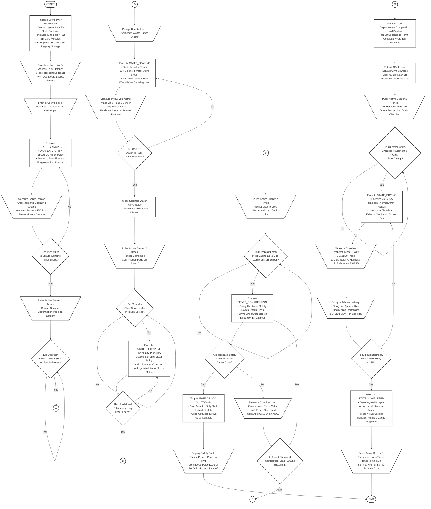

---
config:
  layout: elk
---

```mermaid
graph TD
    %% Style Definitions
    classDef startEndStyle fill:#ffffff,stroke:#333333,stroke-width:2px,color:#333333;
    classDef processStyle fill:#ffffff,stroke:#333333,stroke-width:2px,color:#333333;
    classDef ioStyle fill:#ffffff,stroke:#333333,stroke-width:2px,color:#333333;
    classDef decisionStyle fill:#ffffff,stroke:#333333,stroke-width:2px,color:#333333;

    %% =================================================================
    %% SECTION 1: START, CORES INITIALIZATION, & STAGE 1 (GRINDING)
    %% =================================================================
    F_Start(["START"]):::startEndStyle
    
    P_Init["Initialize Low-Power Subsystems<br/>• Mount Internal LittleFS Flash Partitions<br/>• Initialize External FAT32 SD Card Modules<br/>• Boot preferences.h NVS Registry Storage"]:::processStyle
    
    IO_Hotspot[\"Broadcast Local Wi-Fi Access Point Hotspot<br/>& Host Responsive React PWA Dashboard Layout Assets\"/]:::ioStyle
    
    IO_LoadChar[\"Prompt User to Feed Residual Charcoal Fines into Hopper\"/]:::ioStyle
    
    P_Grind["Execute STATE_GRINDING<br/>• Drive 12V 775 High-Speed DC Motor Relay<br/>• Pulverize Raw Biomass Fragments into Powder"]:::processStyle
    
    IO_ReadINA[\"Measure Grinder Motor Amperage and Operating Voltage<br/>via Asynchronous I2C Bus Power Monitor Sensor\"/]:::ioStyle
    
    D_Grind{"Has Predefined<br/>3-Minute Grinding<br/>Timer Ended?"}:::decisionStyle
    
    IO_Buzz1[\"Pulse Active Buzzer 2 Times <br/>Render Soaking Confirmation Page on Screen\"/]:::ioStyle
    
    D_Gate1{"Did Operator<br/>Click 'Confirm Soak'<br/>on Touch Screen?"}:::decisionStyle

    Conn_A(["A"]):::startEndStyle

    %% Section 1 Flow Paths
    F_Start --> P_Init
    P_Init --> IO_Hotspot
    IO_Hotspot --> IO_LoadChar
    IO_LoadChar --> P_Grind
    P_Grind --> IO_ReadINA
    IO_ReadINA --> D_Grind
    D_Grind -->|No| P_Grind
    D_Grind -->|Yes| IO_Buzz1
    IO_Buzz1 --> D_Gate1
    D_Gate1 -->|No| D_Gate1
    D_Gate1 -->|Yes| Conn_A

    %% =================================================================
    %% SECTION 2: STAGE 2 (SOAKING) & STAGE 3 (COMBINING)
    %% =================================================================
    Conn_A_In(["A"]):::startEndStyle
    
    IO_LoadPaper[\"Prompt User to Insert Shredded Waste Paper Sheets\"/]:::ioStyle
    
    P_Soak["Execute STATE_SOAKING<br/>• Shift Normally Closed 12V Solenoid Water Valve to open<br/>• Run Low-Latency Hall-Effect Pulse Counting Loop"]:::processStyle
    
    IO_ReadFlow[\"Measure Inflow Volumetric Mass via YF-S201 Sensor<br/>Using Microsecond Hardware Interrupt Service Routine\"/]:::ioStyle
    
    D_Soak{"Is Target 1:1<br/>Water-to-Paper<br/>Ratio Reached?"}:::decisionStyle
    
    P_CloseSol["Close Solenoid Water Valve Relay<br/>to Terminate Volumetric Infusion"]:::processStyle
    
    IO_Buzz2[\"Pulse Active Buzzer 2 Times <br/>Render Combining Confirmation Page on Screen\"/]:::ioStyle
    
    D_Gate2{"Did Operator<br/>Click 'Confirm Mix'<br/>on Touch Screen?"}:::decisionStyle
    
    P_Combine["Execute STATE_COMBINING<br/>• Drive 12V Planetary Geared Blending Motor Relay<br/>• Mix Powered Charcoal and Hydrated Paper Slurry Matrix"]:::processStyle
    
    D_Combine{"Has Predefined<br/>5-Minute Mixing<br/>Timer Ended?"}:::decisionStyle

    Conn_B(["B"]):::startEndStyle

    %% Section 2 Flow Paths
    Conn_A_In --> IO_LoadPaper
    IO_LoadPaper --> P_Soak
    P_Soak --> IO_ReadFlow
    IO_ReadFlow --> D_Soak
    D_Soak -->|No| P_Soak
    D_Soak -->|Yes| P_CloseSol
    P_CloseSol --> IO_Buzz2
    IO_Buzz2 --> D_Gate2
    D_Gate2 -->|No| D_Gate2
    D_Gate2 -->|Yes| P_Combine
    P_Combine --> D_Combine
    D_Combine -->|No| P_Combine
    D_Combine -->|Yes| Conn_B

    %% =================================================================
    %% SECTION 3: STAGE 4 (MOLDING & COMPRESSION WITH SAFETY CHECK)
    %% =================================================================
    Conn_B_In(["B"]):::startEndStyle
    
    IO_Buzz3[\"Pulse Active Buzzer 2 Times <br/>Prompt User to Drop Mixture and Lock Casing Lid\"/]:::ioStyle
    
    D_Gate3{"Did Operator Latch<br/>Mold Casing Lid & Click<br/>'Compress' on Screen?"}:::decisionStyle
    
    P_Comp["Execute STATE_COMPRESSION<br/>• Query Hardware Safety Switch Status Lines<br/>• Drive Linear Actuator via BTS7960 IBT-2 Driver"]:::processStyle
    
    D_Safety{"Are Top/Base Safety<br/>Limit Switches<br/>Circuit Open?"}:::decisionStyle
    
    P_ES_Halt["Trigger EMERGENCY SHUTDOWN<br/>• Drop Actuator Duty Cycle Instantly to 0%<br/>• Open-Circuit Inductive Relay Contacts"]:::processStyle
    IO_ES_Alert[\"Display Safety Fault Casing Breach Page on HMI<br/>Continuous Pulse Loop of 5V Active Buzzer System\"/]:::ioStyle
    
    IO_ReadLoad[\"Measure Core Reaction Compressive Force Value<br/>via S-Type 100kg Load Cell and HX711 24-bit ADC\"/]:::ioStyle
    
    D_Force{"Is Target Structural<br/>Compaction Load (2000N)<br/>Sustained?"}:::decisionStyle

    Conn_C(["C"]):::startEndStyle

    %% Section 3 Flow Paths
    Conn_B_In --> IO_Buzz3
    IO_Buzz3 --> D_Gate3
    D_Gate3 -->|No| D_Gate3
    D_Gate3 -->|Yes| P_Comp
    P_Comp --> D_Safety
    D_Safety -->|Yes| P_ES_Halt
    P_ES_Halt --> IO_ES_Alert
    IO_ES_Alert --> F_End
    D_Safety -->|No| IO_ReadLoad
    IO_ReadLoad --> D_Force
    D_Force -->|No| P_Comp
    D_Force -->|Yes| Conn_C

    %% =================================================================
    %% SECTION 4: STATE 5 (DRYING) & SYSTEM FINALIZATION
    %% =================================================================
    Conn_C_In(["C"]):::startEndStyle
    
    P_Hold["Maintain Core Displacement Compaction Hold Position<br/>for 30 Seconds to Form Cellulose Hydrogen Networks"]:::processStyle
    
    P_Retract["Retract 12V Linear Actuator Arm Upwards<br/>Until Top Limit Switch Feedback Changes state"]:::processStyle
    
    IO_Buzz4[\"Pulse Active Buzzer 2 Times <br/>Prompt User to Place Green Product into Drying Chamber\"/]:::ioStyle
    
    D_Gate4{"Did Operator Check<br/>Chamber Placement & Click<br/>'Start Drying'?"}:::decisionStyle
    
    P_Dry["Execute STATE_DRYING<br/>• Energize 4x 12.5W Halogen Thermal Array Relays<br/>• Actuate Chamber Exhaust Ventilation Blower Fan"]:::processStyle
    
    IO_SensRead[\"Measure Chamber Temperature via 1-Wire DS18B20 Probe<br/>& Core Relative Humidity via Polynomial DHT22\"/]:::ioStyle
    
    IO_SDWrite[\"Compile Telemetry Array String and Append Row<br/>Directly onto Standalone SD Card CSV Run Log File\"/]:::ioStyle
    
    D_Dry{"Is Exhaust Boundary<br/>Relative Humidity<br/>≤ 15%?"}:::decisionStyle
    
    P_Finish["Execute STATE_COMPLETED<br/>• De-energize Halogen Array and Ventilation Relays<br/>• Clear Active Session Transient Memory Cache Registers"]:::processStyle
    
    IO_Done[\"Pulse Active Buzzer 3 Predefined Long Times <br/>Render Final Run Summary Performance Stats on GUI\"/]:::ioStyle
    
    F_End(["END"]):::startEndStyle

    %% Section 4 Flow Paths
    Conn_C_In --> P_Hold
    P_Hold --> P_Retract
    P_Retract --> IO_Buzz4
    IO_Buzz4 --> D_Gate4
    D_Gate4 -->|No| D_Gate4
    D_Gate4 -->|Yes| P_Dry
    P_Dry --> IO_SensRead
    IO_SensRead --> IO_SDWrite
    IO_SDWrite --> D_Dry
    D_Dry -->|No| P_Dry
    D_Dry -->|Yes| P_Finish
    P_Finish --> IO_Done
    IO_Done --> F_End
```