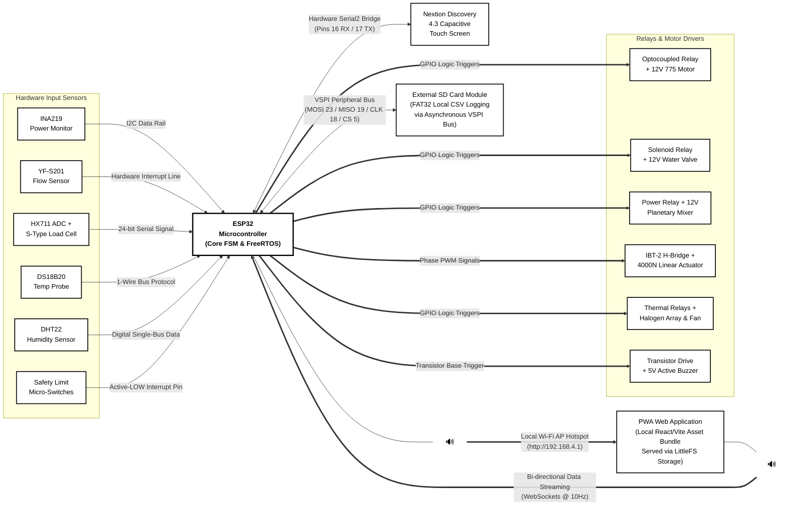

---
config:
  layout: elk
---

```mermaid
graph LR
    %% Style Definitions (Matching the black and white minimalist reference)
    classDef hardwareBlock fill:#ffffff,stroke:#000000,stroke-width:2px,color:#000000;
    classDef mainCore fill:#ffffff,stroke:#000000,stroke-width:3px,color:#000000,font-weight:bold;
    classDef signalIcon fill:#ffffff,stroke:none,color:#000000,font-size:20px;

    %% =================================================================
    %% HARDWARE INPUT DEVICES (LEFT COUPLING)
    %% =================================================================
    subgraph SENSORS ["Hardware Input Sensors"]
        INA219["INA219<br/>Power Monitor"]:::hardwareBlock
        YF_S201["YF-S201<br/>Flow Sensor"]:::hardwareBlock
        HX711["HX711 ADC +<br/>S-Type Load Cell"]:::hardwareBlock
        DS18B20["DS18B20<br/>Temp Probe"]:::hardwareBlock
        DHT22["DHT22<br/>Humidity Sensor"]:::hardwareBlock
        LIMIT_SW["Safety Limit<br/>Micro-Switches"]:::hardwareBlock
    end

    %% =================================================================
    %% MECHANICAL ACTUATOR OUTPUT CONTROLS (BOTTOM COUPLING)
    %% =================================================================
    subgraph ACTUATORS ["Relays & Motor Drivers"]
        RELAY_775["Optocoupled Relay<br/>+ 12V 775 Motor"]:::hardwareBlock
        RELAY_SOL["Solenoid Relay<br/>+ 12V Water Valve"]:::hardwareBlock
        RELAY_GEAR["Power Relay + 12V<br/>Planetary Mixer"]:::hardwareBlock
        IBT2_DRIVE["IBT-2 H-Bridge +<br/>4000N Linear Actuator"]:::hardwareBlock
        RELAY_DRY["Thermal Relays +<br/>Halogen Array & Fan"]:::hardwareBlock
        BUZZ_CIRC["Transistor Drive<br/>+ 5V Active Buzzer"]:::hardwareBlock
    end

    %% =================================================================
    %% CORE CONTROLLER (CENTER ENGINE)
    %% =================================================================
    ESP32_CORE["ESP32<br/>Microcontroller<br/>(Core FSM & FreeRTOS)"]:::mainCore

    %% =================================================================
    %% LOCAL HMI PANEL INTERFACING (TOP COUPLING)
    %% =================================================================
    NEXTION_HMI["Nextion Discovery<br/>4.3 Capacitive<br/>Touch Screen"]:::hardwareBlock

    %% =================================================================
    %% LOCAL-FIRST NETWORKING & SOFTWARE LAYER (RIGHT COUPLING)
    %% =================================================================
    WIFI_ICON1["🔊"]:::signalIcon
    WIFI_ICON2["🔊"]:::signalIcon
    
    PWA_APP["PWA Web Application<br/>(Local React/Vite Asset Bundle<br/>Served via LittleFS Storage)"]:::hardwareBlock
    
    SD_CARD["External SD Card Module<br/>(FAT32 Local CSV Logging<br/>via Asynchronous VSPI Bus)"]:::hardwareBlock

    %% =================================================================
    %% STRUCTURAL WIRE MAPPING SIGNALS
    %% =================================================================
    %% Left Hardware Inputs to Core
    INA219 -->|I2C Data Rail| ESP32_CORE
    YF_S201 -->|Hardware Interrupt Line| ESP32_CORE
    HX711 -->|24-bit Serial Signal| ESP32_CORE
    DS18B20 -->|1-Wire Bus Protocol| ESP32_CORE
    DHT22 -->|Digital Single-Bus Data| ESP32_CORE
    LIMIT_SW -->|Active-LOW Interrupt Pin| ESP32_CORE

    %% Core to Bottom Actuators
    ESP32_CORE ===>|GPIO Logic Triggers| RELAY_775
    ESP32_CORE ===>|GPIO Logic Triggers| RELAY_SOL
    ESP32_CORE ===>|GPIO Logic Triggers| RELAY_GEAR
    ESP32_CORE ===>|Phase PWM Signals| IBT2_DRIVE
    ESP32_CORE ===>|GPIO Logic Triggers| RELAY_DRY
    ESP32_CORE ===>|Transistor Base Trigger| BUZZ_CIRC

    %% Core to Top Display (Bi-directional UART)
    ESP32_CORE <-->|"Hardware Serial2 Bridge<br/>(Pins 16 RX / 17 TX)"| NEXTION_HMI

    %% Core to Local Storage & Wireless Network App (Right Layer)
    ESP32_CORE <-->|"VSPI Peripheral Bus<br/>(MOSI 23 / MISO 19 / CLK 18 / CS 5)"| SD_CARD
    
    ESP32_CORE --- WIFI_ICON1
    WIFI_ICON1 ==>|"Local Wi-Fi AP Hotspot<br/>(http://192.168.4.1)"| PWA_APP
    
    PWA_APP --- WIFI_ICON2
    WIFI_ICON2 ==>|"Bi-directional Data Streaming<br/>(WebSockets @ 10Hz)"| ESP32_CORE
```