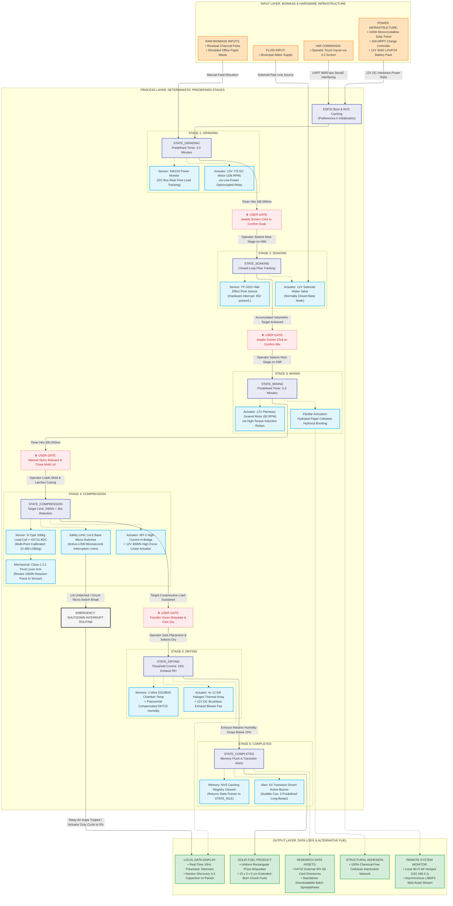

```mermaid
---
config:
  layout: elk
---
graph TD
    %% Style Definitions
    classDef layerStyle fill:#f5f5f5,stroke:#333333,stroke-width:3px,color:#333333;
    classDef inputStyle fill:#ffe2bc,stroke:#ff9233,stroke-width:2px,color:#333333;
    classDef hardwareStyle fill:#e1f5fe,stroke:#03a9f4,stroke-width:2px,color:#333333;
    classDef firmwareStyle fill:#e8eaf6,stroke:#3f51b5,stroke-width:2px,color:#333333;
    classDef outputStyle fill:#d4edda,stroke:#28a745,stroke-width:2px,color:#333333;
    classDef pauseStyle fill:#ffebee,stroke:#ef5350,stroke-width:2px,stroke-dasharray: 4 4,color:#b71c1c;

    %% =================================================================
    %% LAYER 1: BIOMASS & SYSTEM INPUTS
    %% =================================================================
    subgraph SYSTEM_INPUTS ["INPUT LAYER: BIOMASS & HARDWARE INFRASTRUCTURE"]
        In_Biomass["RAW BIOMASS INPUTS:<br>• Residual Charcoal Fines<br>• Shredded Office Paper Waste"]:::inputStyle
        In_Fluid["FLUID INPUT:<br>• Municipal Water Supply"]:::inputStyle
        In_Solar["POWER INFRASTRUCTURE:<br>• 100W Monocrystalline Solar Panel<br>• 10A MPPT Charge Controller<br>• 12V 30Ah LiFePO4 Battery Pack"]:::inputStyle
        In_Control["HMI COMMANDS:<br>• Operator Touch Inputs via 4.3 Screen"]:::inputStyle
    end

    %% =================================================================
    %% LAYER 2: PROCESS LAYER (ESP32 EVENT-DRIVEN FSM)
    %% =================================================================
    subgraph FSM_PIPELINE ["PROCESS LAYER: DETERMINISTIC PREDEFINED STAGES"]
        
        P0_Boot["ESP32 Boot & NVS Caching<br/>(Preferences.h Initialization)"]:::firmwareStyle
        
        %% STAGE 1
        subgraph STAGE_1 ["STAGE 1: GRINDING"]
            P1_Grind["STATE_GRINDING<br/>Predefined Timer: 3.0 Minutes"]:::firmwareStyle
            HW_P1_Act["Actuator: 12V 775 DC Motor (10k RPM)<br/>via Low-Power Optocoupled Relay"]:::hardwareStyle
            HW_P1_Sens["Sensor: INA219 Power Monitor<br/>(I2C Bus Real-Time Load Tracking)"]:::hardwareStyle
            
            P1_Grind -.-> HW_P1_Act
            P1_Grind -.-> HW_P1_Sens
        end

        Pause_1["⏸️ USER GATE:<br/>Awaits Screen Click to Confirm Soak"]:::pauseStyle

        %% STAGE 2
        subgraph STAGE_2 ["STAGE 2: SOAKING"]
            P2_Soak["STATE_SOAKING<br/>Closed-Loop Flow Tracking"]:::firmwareStyle
            HW_P2_Act["Actuator: 12V Solenoid Water Valve<br/>(Normally Closed Base Node)"]:::hardwareStyle
            HW_P2_Sens["Sensor: YF-S201 Hall-Effect Flow Sensor<br/>(Hardware Interrupt: 450 pulses/L)"]:::hardwareStyle
            
            P2_Soak -.-> HW_P2_Act
            P2_Soak -.-> HW_P2_Sens
        end

        Pause_2["⏸️ USER GATE:<br/>Awaits Screen Click to Confirm Mix"]:::pauseStyle

        %% STAGE 3
        subgraph STAGE_3 ["STAGE 3: MIXING"]
            P3_Mix["STATE_MIXING<br/>Predefined Timer: 5.0 Minutes"]:::firmwareStyle
            HW_P3_Act["Actuator: 12V Planetary Geared Motor (60 RPM)<br/>via High-Torque Inductive Relays"]:::hardwareStyle
            HW_P3_Chem["Fibrillar Activation:<br/>Hydrated Paper Cellulose Hydroxyl Bonding"]:::hardwareStyle
            
            P3_Mix -.-> HW_P3_Act
            P3_Mix -.-> HW_P3_Chem
        end

        Pause_3["⏸️ USER GATE:<br/>Manual Slurry Release & Close Mold Lid"]:::pauseStyle

        %% STAGE 4
        subgraph STAGE_4 ["STAGE 4: COMPRESSION"]
            P4_Comp["STATE_COMPRESSION<br/>Target Limit: 2000N + 30s Retention"]:::firmwareStyle
            HW_P4_Act["Actuator: IBT-2 High-Current H-Bridge<br/>+ 12V 4000N High-Force Linear Actuator"]:::hardwareStyle
            HW_P4_Sens["Sensor: S-Type 100kg Load Cell + HX711 ADC<br/>(Multi-Point Calibrated: 22,480 LSB/kg)"]:::hardwareStyle
            HW_P4_Mech["Mechanical: Class-1 2:1 Pivot Lever Arm<br/>(Routes 1000N Reaction Force to Sensor)"]:::hardwareStyle
            HW_P4_Safe["Safety Limit: Lid & Base Micro-Switches<br/>(Active-LOW Microsecond Interruption Lines)"]:::hardwareStyle
            
            P4_Comp -.-> HW_P4_Act
            P4_Comp -.-> HW_P4_Sens
            HW_P4_Sens -.-> HW_P4_Mech
            P4_Comp -.-> HW_P4_Safe
        end

        Pause_4["⏸️ USER GATE:<br/>Transfer Green Briquette & Click Dry"]:::pauseStyle

        %% STAGE 5
        subgraph STAGE_5 ["STAGE 5: DRYING"]
            P5_Dry["STATE_DRYING<br/>Threshold Control: 15% Exhaust RH"]:::firmwareStyle
            HW_P5_Act["Actuator: 4x 12.5W Halogen Thermal Array<br/>+ 12V DC Brushless Exhaust Blower Fan"]:::hardwareStyle
            HW_P5_Sens["Sensors: 1-Wire DS18B20 Chamber Temp<br/>+ Polynomial-Compensated DHT22 Humidity"]:::hardwareStyle
            
            P5_Dry -.-> HW_P5_Act
            P5_Dry -.-> HW_P5_Sens
        end

        %% STAGE 6
        subgraph STAGE_6 ["STAGE 6: COMPLETED"]
            P6_Comp["STATE_COMPLETED<br/>Memory Flush & Transistor Alerts"]:::firmwareStyle
            HW_P6_Act["Alert: 5V Transistor-Driven Active Buzzer<br/>(Audible Cue: 3 Predefined Long Beeps)"]:::hardwareStyle
            HW_P6_Mem["Memory: NVS Caching Registry Cleared<br/>(Returns State Pointer to STATE_IDLE)"]:::hardwareStyle
            
            P6_Comp -.-> HW_P6_Act
            P6_Comp -.-> HW_P6_Mem
        end
        
        E_Stop["EMERGENCY SHUTDOWN INTERRUPT ROUTINE"]:::layerStyle
    end

    %% =================================================================
    %% LAYER 3: SYSTEM OUTPUTS
    %% =================================================================
    subgraph SYSTEM_OUTPUTS ["OUTPUT LAYER: DATA LOGS & ALTERNATIVE FUEL"]
        Out_Fuel["SOLID FUEL PRODUCT:<br/>• Uniform Rectangular Prism Briquettes<br/>• 10 x 5 x 5 cm Extended-Burn Chunk Fuels"]:::outputStyle
        Out_Bond["STRUCTURAL ADHESION:<br/>• 100% Chemical-Free Cellulose Interlocked Network"]:::outputStyle
        Out_HMI["LOCAL DATA DISPLAY:<br/>• Real-Time 10Hz Parameter Telemetry<br/>• Nextion Discovery 4.3 Capacitive UI Panels"]:::outputStyle
        Out_PWA["REMOTE SYSTEM MONITOR:<br/>• Local Wi-Fi AP Hotspot (192.168.4.1)<br/>• Asynchronous LittleFS Web Asset Stream"]:::outputStyle
        Out_CSV["RESEARCH DATA ASSETS:<br/>• FAT32 External SPI SD Card Directories<br/>• Standalone Downloadable Batch Spreadsheets"]:::outputStyle
    end

    %% --- FLOW MAP COUPLING ---
    %% Input to Process Maps
    In_Solar -->|"12V DC Hardware Power Rails"| P0_Boot
    In_Control -->|"UART 9600 bps Serial2 Interfacing"| P0_Boot
    In_Biomass -->|"Manual Feed Allocation"| P1_Grind
    In_Fluid -->|"Solenoid Pipe Line Source"| HW_P2_Act

    %% Predefined Sequential FSM Transitions with Manual User Gates
    P0_Boot --> P1_Grind
    P1_Grind -->|"Timer Hits 180,000ms"| Pause_1
    Pause_1 -->|"Operator Selects Next Stage on HMI"| P2_Soak
    P2_Soak -->|"Accumulated Volumetric Target Achieved"| Pause_2
    Pause_2 -->|"Operator Selects Next Stage on HMI"| P3_Mix
    P3_Mix -->|"Timer Hits 300,000ms"| Pause_3
    Pause_3 -->|"Operator Loads Mold & Latches Casing"| P4_Comp
    P4_Comp -->|"Target Compressive Load Sustained"| Pause_4
    Pause_4 -->|"Operator Sets Placement & Selects Dry"| P5_Dry
    P5_Dry -->|"Exhaust Relative Humidity Drops Below 15%"| P6_Comp

    %% Safety Interruption Map
    HW_P4_Safe -->|"Lid Unlatched / Circuit Micro-Switch Break"| E_Stop
    E_Stop -->|"Relay Air-Gaps Tripped / Actuator Duty Cycle to 0%"| Out_HMI

    %% Process to Output Maps
    P6_Comp --> Out_Fuel
    HW_P3_Chem -.-> Out_Bond
    P5_Dry -.-> Out_HMI
    P0_Boot -.-> Out_PWA
    P6_Comp -.-> Out_CSV
```