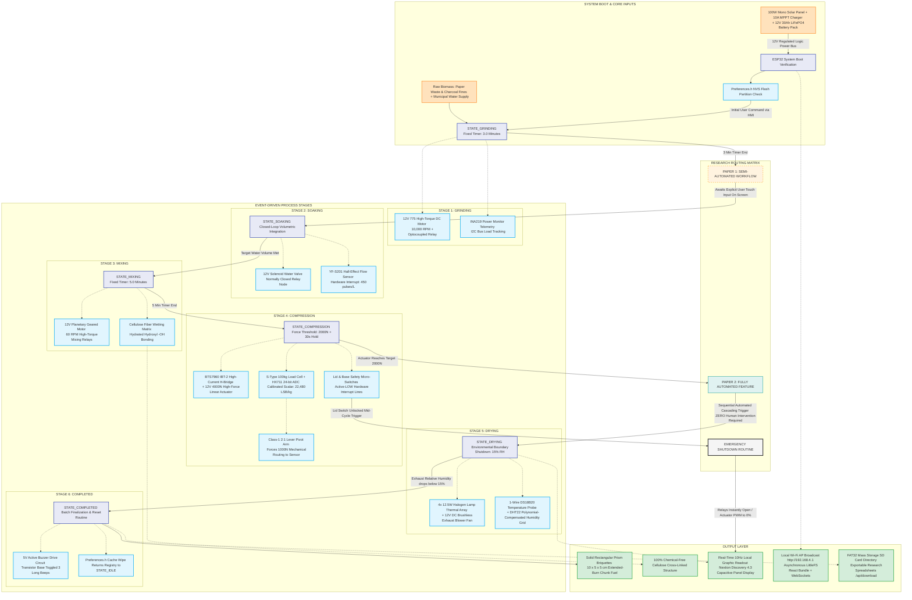

---
config:
  layout: elk
---

```mermaid
graph TD
    %% Style Definitions
    classDef layerStyle fill:#f5f5f5,stroke:#333333,stroke-width:3px,color:#333333;
    classDef inputStyle fill:#ffe2bc,stroke:#ff9233,stroke-width:2px,color:#333333;
    classDef hardwareStyle fill:#e1f5fe,stroke:#03a9f4,stroke-width:2px,color:#333333;
    classDef firmwareStyle fill:#e8eaf6,stroke:#3f51b5,stroke-width:2px,color:#333333;
    classDef outputStyle fill:#d4edda,stroke:#28a745,stroke-width:2px,color:#333333;
    classDef paper1Style fill:#fff3e0,stroke:#ffb74d,stroke-width:2px,stroke-dasharray: 5 5,color:#333333;
    classDef paper2Style fill:#e0f2f1,stroke:#4db6ac,stroke-width:2px,color:#333333;

    %% =================================================================
    %% LAYER 1: GLOBAL INPUTS & INITIALIZATION
    %% =================================================================
    subgraph SYSTEM_INIT ["SYSTEM BOOT & CORE INPUTS"]
        In_Materials["Raw Biomass: Paper Waste & Charcoal Fines <br> + Municipal Water Supply"]:::inputStyle
        In_Solar["100W Mono Solar Panel + 10A MPPT Charger <br> + 12V 30Ah LiFePO4 Battery Pack"]:::inputStyle
        
        P0_Boot["ESP32 System Boot Verification"]:::firmwareStyle
        HW_P0["Preferences.h NVS Flash Partition Check"]:::hardwareStyle
        
        In_Solar -->|"12V Regulated Logic Power Bus"| P0_Boot
        In_Materials --> P1_Grind
    end

    %% =================================================================
    %% LAYER 2: STAGE PROCESS PIPELINE (THE PREDEFINED FSM)
    %% =================================================================
    subgraph FSM_PIPELINE ["EVENT-DRIVEN PROCESS STAGES"]
        
        %% STAGE 1
        subgraph STAGE_1 ["STAGE 1: GRINDING"]
            P1_Grind["STATE_GRINDING <br> Fixed Timer: 3.0 Minutes"]:::firmwareStyle
            HW_P1_Act["12V 775 High-Torque DC Motor <br> 10,000 RPM + Optocoupled Relay"]:::hardwareStyle
            HW_P1_Sens["INA219 Power Monitor Telemetry <br> I2C Bus Load Tracking"]:::hardwareStyle
            
            P1_Grind -.-> HW_P1_Act
            P1_Grind -.-> HW_P1_Sens
        end

        %% STAGE 2
        subgraph STAGE_2 ["STAGE 2: SOAKING"]
            P2_Soak["STATE_SOAKING <br> Closed-Loop Volumetric Integration"]:::firmwareStyle
            HW_P2_Act["12V Solenoid Water Valve <br> Normally Closed Relay Node"]:::hardwareStyle
            HW_P2_Sens["YF-S201 Hall-Effect Flow Sensor <br> Hardware Interrupt: 450 pulses/L"]:::hardwareStyle
            
            P2_Soak -.-> HW_P2_Act
            P2_Soak -.-> HW_P2_Sens
        end

        %% STAGE 3
        subgraph STAGE_3 ["STAGE 3: MIXING"]
            P3_Mix["STATE_MIXING <br> Fixed Timer: 5.0 Minutes"]:::firmwareStyle
            HW_P3_Act["12V Planetary Geared Motor <br> 60 RPM High-Torque Mixing Relays"]:::hardwareStyle
            HW_P3_Chem["Cellulose Fiber Wetting Matrix <br> Hydrated Hydroxyl -OH Bonding"]:::hardwareStyle
            
            P3_Mix -.-> HW_P3_Act
            P3_Mix -.-> HW_P3_Chem
        end

        %% STAGE 4
        subgraph STAGE_4 ["STAGE 4: COMPRESSION"]
            P4_Comp["STATE_COMPRESSION <br> Force Threshold: 2000N + 30s Hold"]:::firmwareStyle
            HW_P4_Act["BTS7960 IBT-2 High-Current H-Bridge <br> + 12V 4000N High-Force Linear Actuator"]:::hardwareStyle
            HW_P4_Sens["S-Type 100kg Load Cell + HX711 24-bit ADC <br> Calibrated Scalar: 22,480 LSB/kg"]:::hardwareStyle
            HW_P4_Mech["Class-1 2:1 Lever Pivot Arm <br> Forces 1000N Mechanical Routing to Sensor"]:::hardwareStyle
            HW_P4_Safe["Lid & Base Safety Micro-Switches <br> Active-LOW Hardware Interrupt Lines"]:::hardwareStyle
            
            P4_Comp -.-> HW_P4_Act
            P4_Comp -.-> HW_P4_Sens
            HW_P4_Sens -.-> HW_P4_Mech
            P4_Comp -.-> HW_P4_Safe
        end

        %% STAGE 5
        subgraph STAGE_5 ["STAGE 5: DRYING"]
            P5_Dry["STATE_DRYING <br> Environmental Boundary Shutdown: 15% RH"]:::firmwareStyle
            HW_P5_Act["4x 12.5W Halogen Lamp Thermal Array <br> + 12V DC Brushless Exhaust Blower Fan"]:::hardwareStyle
            HW_P5_Sens["1-Wire DS18B20 Temperature Probe <br> + DHT22 Polynomial-Compensated Humidity Grid"]:::hardwareStyle
            
            P5_Dry -.-> HW_P5_Act
            P5_Dry -.-> HW_P5_Sens
        end

        %% STAGE 6
        subgraph STAGE_6 ["STAGE 6: COMPLETED"]
            P6_Comp["STATE_COMPLETED <br> Batch Finalization & Reset Routine"]:::firmwareStyle
            HW_P6_Act["5V Active Buzzer Drive Circuit <br> Transistor Base Toggled 3 Long Beeps"]:::hardwareStyle
            HW_P6_Mem["Preferences.h Cache Wipe <br> Returns Registry to STATE_IDLE"]:::hardwareStyle
            
            P6_Comp -.-> HW_P6_Act
            P6_Comp -.-> HW_P6_Mem
        end
    end

    %% =================================================================
    %% LAYER 3: MULTI-PAPER RESEARCH FLOW LOGIC (THE SEPARATION)
    %% =================================================================
    subgraph STRATEGY_GATES ["RESEARCH ROUTING MATRIX"]
        Gate_P1["PAPER 1: SEMI-AUTOMATED WORKFLOW"]:::paper1Style
        Gate_P2["PAPER 2: FULLY AUTOMATED FEATURE"]:::paper2Style
        
        E_Stop["EMERGENCY SHUTDOWN ROUTINE"]:::layerStyle
    end

    %% =================================================================
    %% LAYER 4: SYSTEM OUTPUTS
    %% =================================================================
    subgraph SYSTEM_OUTPUT ["OUTPUT LAYER"]
        Out_Fuel["Solid Rectangular Prism Briquettes <br> 10 x 5 x 5 cm Extended-Burn Chunk Fuel"]:::outputStyle
        Out_Bond["100% Chemical-Free Cellulose Cross-Linked Structure"]:::outputStyle
        Out_HMI["Real-Time 10Hz Local Graphic Readout <br> Nextion Discovery 4.3 Capacitive Panel Display"]:::outputStyle
        Out_PWA["Local Wi-Fi AP Broadcast http://192.168.4.1 <br> Asynchronous LittleFS React Bundle + WebSockets"]:::outputStyle
        Out_CSV["FAT32 Mass Storage SD Card Directory <br> Exportable Research Spreadsheets /api/download"]:::outputStyle
    end

    %% Pipeline Execution Connections
    P0_Boot --> HW_P0
    HW_P0 -->|"Initial User Command via HMI"| P1_Grind
    
    %% Paper 1 vs Paper 2 Logic Routing Mapping
    P1_Grind -->|"3 Min Timer End"| Gate_P1
    Gate_P1 -->|"Awaits Explicit User Touch Input On Screen"| P2_Soak
    
    P2_Soak -->|"Target Water Volume Met"| P3_Mix
    P3_Mix -->|"5 Min Timer End"| P4_Comp
    
    P4_Comp -->|"Actuator Reaches Target 2000N"| Gate_P2
    Gate_P2 -->|"Sequential Automated Cascading Trigger <br> ZERO Human Intervention Required"| P5_Dry
    
    P5_Dry -->|"Exhaust Relative Humidity drops below 15%"| P6_Comp

    %% Hardware Safety Breaks
    HW_P4_Safe -->|"Lid Switch Unlocked Mid-Cycle Trigger"| E_Stop
    E_Stop -->|"Relays Instantly Open / Actuator PWM to 0%"| Out_HMI

    %% Output Mapping Connections
    P6_Comp --> Out_Fuel
    HW_P3_Chem -.-> Out_Bond
    P0_Boot -.-> Out_PWA
    P5_Dry -.-> Out_HMI
    P6_Comp -.-> Out_CSV
```