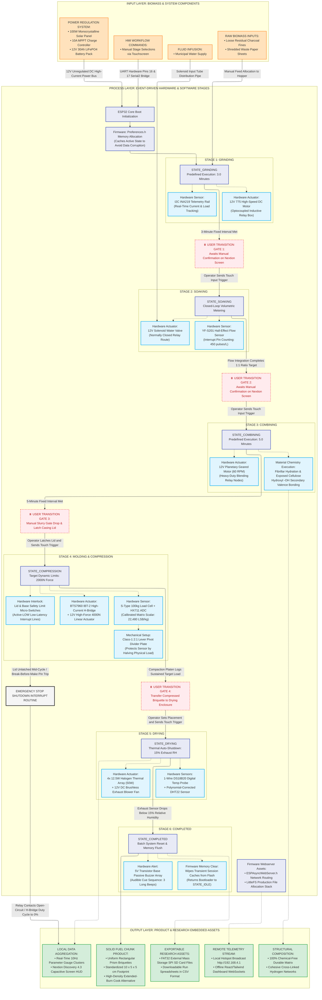

```mermaid
---
config:
  layout: elk
---
graph TD
    %% Style Definitions
    classDef layerStyle fill:#f5f5f5,stroke:#333333,stroke-width:3px,color:#333333;
    classDef inputStyle fill:#ffe2bc,stroke:#ff9233,stroke-width:2px,color:#333333;
    classDef hardwareStyle fill:#e1f5fe,stroke:#03a9f4,stroke-width:2px,color:#333333;
    classDef firmwareStyle fill:#e8eaf6,stroke:#3f51b5,stroke-width:2px,color:#333333;
    classDef outputStyle fill:#d4edda,stroke:#28a745,stroke-width:2px,color:#333333;
    classDef pauseStyle fill:#ffebee,stroke:#ef5350,stroke-width:2px,stroke-dasharray: 4 4,color:#b71c1c;

    %% =================================================================
    %% LAYER 1: BIOMASS, FLUID, POWER, & CONTROL INPUTS
    %% =================================================================
    subgraph INPUT_LAYER ["INPUT LAYER: BIOMASS & SYSTEM COMPONENTS"]
        In_Biomass["RAW BIOMASS INPUTS:<br>• Loose Residual Charcoal Fines<br>• Shredded Waste Paper Sheets"]:::inputStyle
        In_Fluid["FLUID INFUSION:<br>• Municipal Water Supply"]:::inputStyle
        In_Power["POWER REGULATION SYSTEM:<br>• 100W Monocrystalline Solar Panel<br>• 10A MPPT Charge Controller<br>• 12V 30Ah LiFePO4 Battery Pack"]:::inputStyle
        In_Control["HMI WORKFLOW COMMANDS:<br>• Manual Stage Selections via Touchscreen"]:::inputStyle
    end

    %% =================================================================
    %% LAYER 2: PROCESS ENGINE (ESP32 DETERMINISTIC FSM)
    %% =================================================================
    subgraph PROCESS_LAYER ["PROCESS LAYER: EVENT-DRIVEN HARDWARE & SOFTWARE STAGES"]
        
        P0_Boot["ESP32 Core Boot Initialization"]:::firmwareStyle
        SF_NVS["Firmware: Preferences.h Memory Allocation<br/>(Caches Active State to Avoid Data Corruption)"]:::firmwareStyle
        
        %% STAGE 1
        subgraph STAGE_1 ["STAGE 1: GRINDING"]
            P1_Grind["STATE_GRINDING<br/>Predefined Execution: 3.0 Minutes"]:::firmwareStyle
            HW_P1_Act["Hardware Actuator:<br>12V 775 High-Speed DC Motor<br>(Optocoupled Inductive Relay Box)"]:::hardwareStyle
            HW_P1_Sens["Hardware Sensor:<br>I2C INA219 Telemetry Rail<br>(Real-Time Current & Load Tracking)"]:::hardwareStyle
            
            P1_Grind -.-> HW_P1_Act
            P1_Grind -.-> HW_P1_Sens
        end

        Pause_1["⏸️ USER TRANSITION GATE 1:<br/>Awaits Manual Confirmation on Nextion Screen"]:::pauseStyle

        %% STAGE 2
        subgraph STAGE_2 ["STAGE 2: SOAKING"]
            P2_Soak["STATE_SOAKING<br/>Closed-Loop Volumetric Metering"]:::firmwareStyle
            HW_P2_Act["Hardware Actuator:<br>12V Solenoid Water Valve<br>(Normally Closed Relay Route)"]:::hardwareStyle
            HW_P2_Sens["Hardware Sensor:<br>YF-S201 Hall-Effect Flow Sensor<br>(Interrupt Pin Counting: 450 pulses/L)"]:::hardwareStyle
            
            P2_Soak -.-> HW_P2_Act
            P2_Soak -.-> HW_P2_Sens
        end

        Pause_2["⏸️ USER TRANSITION GATE 2:<br/>Awaits Manual Confirmation on Nextion Screen"]:::pauseStyle

        %% STAGE 3
        subgraph STAGE_3 ["STAGE 3: COMBINING"]
            P3_Combine["STATE_COMBINING<br/>Predefined Execution: 5.0 Minutes"]:::firmwareStyle
            HW_P3_Act["Hardware Actuator:<br>12V Planetary Geared Motor (60 RPM)<br>(Heavy-Duty Blending Relay Nodes)"]:::hardwareStyle
            HW_P3_Chem["Material Chemistry Execution:<br>Fibrillar Hydration & Exposed Cellulose<br>Hydroxyl -OH Secondary Valence Bonding"]:::hardwareStyle
            
            P3_Combine -.-> HW_P3_Act
            P3_Combine -.-> HW_P3_Chem
        end

        Pause_3["⏸️ USER TRANSITION GATE 3:<br/>Manual Slurry Gate Drop & Latch Casing Lid"]:::pauseStyle

        %% STAGE 4
        subgraph STAGE_4 ["STAGE 4: MOLDING & COMPRESSION"]
            P4_Comp["STATE_COMPRESSION<br/>Target Dynamic Limits: 2000N Force"]:::firmwareStyle
            HW_P4_Act["Hardware Actuator:<br>BTS7960 IBT-2 High-Current H-Bridge<br>+ 12V High-Force 4000N Linear Actuator"]:::hardwareStyle
            HW_P4_Sens["Hardware Sensor:<br>S-Type 100kg Load Cell + HX711 ADC<br>(Calibrated Matrix Scalar: 22,480 LSB/kg)"]:::hardwareStyle
            HW_P4_Mech["Mechanical Setup:<br>Class-1 2:1 Lever Pivot Divider Plate<br>(Protects Sensor by Halving Physical Load)"]:::hardwareStyle
            HW_P4_Safe["Hardware Interlock:<br>Lid & Base Safety Limit Micro-Switches<br>(Active-LOW Low-Latency Interrupt Lines)"]:::hardwareStyle
            
            P4_Comp -.-> HW_P4_Act
            P4_Comp -.-> HW_P4_Sens
            HW_P4_Sens -.-> HW_P4_Mech
            P4_Comp -.-> HW_P4_Safe
        end

        Pause_4["⏸️ USER TRANSITION GATE 4:<br/>Transfer Compressed Briquette to Drying Enclosure"]:::pauseStyle

        %% STAGE 5
        subgraph STAGE_5 ["STAGE 5: DRYING"]
            P5_Dry["STATE_DRYING<br/>Thermal Auto-Shutdown: 15% Exhaust RH"]:::firmwareStyle
            HW_P5_Act["Hardware Actuator:<br>4x 12.5W Halogen Thermal Array (50W)<br>+ 12V DC Brushless Exhaust Blower Fan"]:::hardwareStyle
            HW_P5_Sens["Hardware Sensors:<br>1-Wire DS18B20 Digital Temp Probe<br>+ Polynomial-Corrected DHT22 Sensor"]:::hardwareStyle
            
            P5_Dry -.-> HW_P5_Act
            P5_Dry -.-> HW_P5_Sens
        end

        %% STAGE 6
        subgraph STAGE_6 ["STAGE 6: COMPLETED"]
            P6_Comp["STATE_COMPLETED<br/>Batch System Reset & Memory Flush"]:::firmwareStyle
            HW_P6_Act["Hardware Alert:<br>5V Transistor Base Passive Buzzer Array<br>(Audible Cue Sequence: 3 Long Beeps)"]:::hardwareStyle
            HW_P6_Mem["Firmware Memory Clear:<br>Wipes Transient Session Caches from Flash<br>(Returns Bootloader to STATE_IDLE)"]:::hardwareStyle
            
            P6_Comp -.-> HW_P6_Act
            P6_Comp -.-> HW_P6_Mem
        end
        
        SF_HTTP["Firmware Webserver Assets:<br/>• ESPAsyncWebServer.h Network Routing<br/>• LittleFS Production File Allocation Stack"]:::firmwareStyle
        E_Stop["EMERGENCY STOP SHUTDOWN INTERRUPT ROUTINE"]:::layerStyle
    end

    %% =================================================================
    %% LAYER 3: SYSTEM OUTPUTS
    %% =================================================================
    subgraph OUTPUT_LAYER ["OUTPUT LAYER: PRODUCT & RESEARCH EMBEDDED ASSETS"]
        Out_Fuel["SOLID FUEL CHUNK PRODUCT:<br>• Uniform Rectangular Prism Briquettes<br>• Standardized 10 x 5 x 5 cm Footprint<br>• High-Density Extended-Burn Cook Alternative"]:::outputStyle
        Out_Matrix["STRUCTURAL COMPOSITION:<br>• 100% Chemical-Free Durable Matrix<br>• Cohesive Cross-Linked Hydrogen Networks"]:::outputStyle
        Out_HMI["LOCAL DATA AGGREGATION:<br>• Real-Time 10Hz Parameter Gauge Clusters<br>• Nextion Discovery 4.3 Capacitive Screen HUD"]:::outputStyle
        Out_PWA["REMOTE TELEMETRY STREAM:<br>• Local Hotspot Broadcast http://192.168.4.1<br>• Offline React/Tailwind Dashboard WebSockets"]:::outputStyle
        Out_Logs["EXPORTABLE RESEARCH ASSETS:<br>• FAT32 External Mass Storage SPI SD Card Files<br>• Downloadable Run Spreadsheets in CSV Format"]:::outputStyle
    end

    %% --- PIPELINE FLOW DIRECTION MATRICES ---
    %% Input Routing
    In_Power -->|"12V Unregulated DC High-Current Power Bus"| P0_Boot
    In_Control -->|"UART Hardware Pins 16 & 17 Serial2 Bridge"| P0_Boot
    In_Biomass -->|"Manual Feed Allocation to Hopper"| P1_Grind
    In_Fluid -->|"Solenoid Input Tube Distribution Pipe"| HW_P2_Act

    %% Core Process Step Interlocking with Mandatory Semi-Automated User Gates
    P0_Boot --> SF_NVS
    SF_NVS --> P1_Grind
    P1_Grind -->|"3-Minute Fixed Interval Met"| Pause_1
    Pause_1 -->|"Operator Sends Touch Input Trigger"| P2_Soak
    P2_Soak -->|"Flow Integration Completes 1:1 Ratio Target"| Pause_2
    Pause_2 -->|"Operator Sends Touch Input Trigger"| P3_Combine
    P3_Combine -->|"5-Minute Fixed Interval Met"| Pause_3
    Pause_3 -->|"Operator Latches Lid and Sends Touch Trigger"| P4_Comp
    P4_Comp -->|"Compaction Platen Logs Sustained Target Load"| Pause_4
    Pause_4 -->|"Operator Sets Placement and Sends Touch Trigger"| P5_Dry
    P5_Dry -->|"Exhaust Sensor Drops Below 15% Relative Humidity"| P6_Comp

    %% Hardware Interlock Emergency Break Routine
    HW_P4_Safe -->|"Lid Unlatched Mid-Cycle / Break-Before-Make Pin Trip"| E_Stop
    E_Stop -->|"Relay Contacts Open-Circuit / H-Bridge Duty Cycle to 0%"| Out_HMI

    %% Output Node Conversions
    P6_Comp --> Out_Fuel
    HW_P3_Chem -.-> Out_Matrix
    P5_Dry -.-> Out_HMI
    SF_HTTP -.-> Out_PWA
    P6_Comp -.-> Out_Logs
```