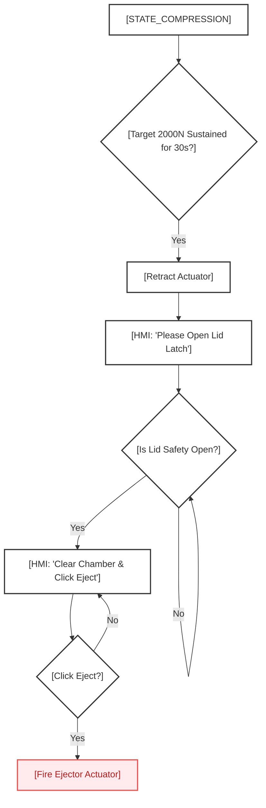

Flowchart Analysis & Engineering Critique: Paper 1 Semi-Automated Baseline

This document provides a comprehensive process translation, Mermaid diagram visualizations, and an academic computer engineering critique of the updated system flowchart (FLOW CHART CHP3.drawio.xml) for the Solar-Powered Semi-Automated Paper-Charcoal Briquetting Machine.

## Part 1: Process Flowchart Visualizations

### 1. The Literal XML Flowchart (As-Is Mapping)

This diagram maps out your current XML pages, decision diamonds, process nodes, and off-page connectors ($A$, $B$, $C$, $D$, $E$) exactly as they are currently configured in your Draw.io workspace.

```mermaid
flowchart TD
    %% Style Definitions
    classDef startEndStyle fill:#ffffff,stroke:#333333,stroke-width:2px,color:#333333;
    classDef processStyle fill:#ffffff,stroke:#333333,stroke-width:2px,color:#333333;
    classDef ioStyle fill:#ffffff,stroke:#333333,stroke-width:2px,color:#333333;
    classDef decisionStyle fill:#ffffff,stroke:#333333,stroke-width:2px,color:#333333;
    classDef connectorStyle fill:#f5f5f5,stroke:#333333,stroke-width:2px,stroke-dasharray: 2 2,color:#333333;

    %% PAGE 1: START TO SYNCHRONIZATION
    P1_Start([START]):::startEndStyle
    P1_Init["Initialize Low-Power Subsystems<br/>• Mount LittleFS Partitions<br/>• Init FAT32 SD Card Modules<br/>• Boot preferences.h NVS"]:::processStyle
    P1_Net["Broadcast Local Wi-Fi AP Hotspot<br/>& Host React PWA Assets"]:::processStyle
    P1_PromptPaper[\HMI OUTPUT: Prompt User to Feed Paper waste into Hopper/]:::ioStyle
    P1_GateSoak{START:<br/>STATE_SOAKING?}:::decisionStyle
    
    P1_Start --> P1_Init
    P1_Init --> P1_Net
    P1_Net --> P1_PromptPaper
    P1_PromptPaper --> P1_GateSoak
    
    P1_GateSoak -->|No| P1_GateSoak
    P1_GateSoak -->|Yes| P1_Soak["Execute STATE_SOAKING<br/>• Open Solenoid Water Valve<br/>• Run Hall-Effect Pulse Counting"]:::processStyle
    
    P1_ReadFlow[\Measure Inflow Volumetric Mass via YF-S201 Sensor/]:::ioStyle
    P1_CheckWater{Is Target water<br/>level reached?}:::decisionStyle
    
    P1_Soak --> P1_ReadFlow
    P1_ReadFlow --> P1_CheckWater
    P1_CheckWater -->|No| P1_Soak
    P1_CheckWater -->|Yes| P1_CloseSol["Close Solenoid Water Valve Relay"]:::processStyle
    
    P1_GateMix{Did Operator Click<br/>Confirm Mix?}:::decisionStyle
    P1_Mix["Execute STATE_MIXING<br/>• Run 12V DC High-Torque Motor"]:::processStyle
    
    P1_CloseSol --> P1_GateMix
    P1_GateMix -->|No| P1_GateMix
    P1_GateMix -->|Yes| P1_Mix
    
    P1_PromptCoal[\HMI OUTPUT: Feed Residual Charcoal Fines into Hopper/]:::ioStyle
    P1_GateGrind{START:<br/>STATE_GRINDING?}:::decisionStyle
    
    P1_Mix --> P1_PromptCoal
    P1_PromptCoal --> P1_GateGrind
    P1_GateGrind -->|No| P1_GateGrind
    P1_GateGrind -->|Yes| P1_Grind["Execute STATE_GRINDING<br/>• Close 12V 775 Motor Relay<br/>• Pulverize Charcoal"]:::processStyle
    
    P1_ReadINA[\Measure Grinder Amps & Operating Volts via I2C INA219/]:::ioStyle
    P1_CheckGrind{Has Predefined<br/>3-Minute Grinding<br/>Timer Ended?}:::decisionStyle
    
    P1_Grind --> P1_ReadINA
    P1_ReadINA --> P1_CheckGrind
    P1_CheckGrind -->|No| P1_Grind
    P1_CheckGrind -->|Yes| P1_Pulse[\Pulse Active Buzzer 2 Times & Render Screen/]:::ioStyle
    
    P1_CheckSync{Soaking and Grinding<br/>Complete?}:::decisionStyle
    P1_Pulse --> P1_CheckSync
    P1_CheckSync -->|Yes| Conn_B_Out([B]):::connectorStyle

    %% PAGE 2: DRAINING & COMBINING
    Conn_B_In([B]):::connectorStyle
    P2_GateCombine{Did Operator Click<br/>'Confirm Combine'<br/>on Touch Screen?}:::decisionStyle
    P2_Transfer["Execute: STATE_TRANSFER1"]:::processStyle
    P2_CheckDrain{Finished Drain?}:::decisionStyle
    P2_OpenDrain[\Open Drain Valve on Phase 2 Level/]:::ioStyle
    P2_GateCombine2{Combine?}:::decisionStyle
    
    Conn_B_In --> P2_GateCombine
    P2_GateCombine -->|No| Conn_A_Out([A]):::connectorStyle
    P2_GateCombine -->|Yes| P2_Transfer
    P2_Transfer --> P2_CheckDrain
    P2_CheckDrain -->|No| P2_OpenDrain --> P2_CheckDrain
    P2_CheckDrain -->|Yes| P2_GateCombine2
    
    P2_OpenCoal["Open Coal Valve via Servo Motor"]:::processStyle
    P2_ActERM[\Activate ERM Vibration Motor/]:::ioStyle
    P2_Planetary["Turn Planetary Motor On"]:::processStyle
    P2_CheckMix{Is Mix Done?}:::decisionStyle
    P2_WaitMix[\Wait 5 Mins/]:::ioStyle
    
    P2_GateCombine2 -->|Yes| P2_OpenCoal
    P2_OpenCoal --> P2_ActERM
    P2_ActERM --> P2_Planetary
    P2_Planetary --> P2_CheckMix
    P2_CheckMix -->|No| P2_WaitMix --> P2_CheckMix
    
    P2_StopPlanetary["Turn Planetary Motor Off"]:::processStyle
    P2_Dump[\Activate 2 Actuators to Open Bottom Half/]:::ioStyle
    
    P2_CheckMix -->|Yes| P2_StopPlanetary
    P2_StopPlanetary --> P2_Dump
    P2_Dump --> Conn_C_Out([C]):::connectorStyle

    %% OFF-PAGE LOOP BACK
    Conn_A_In([A]):::connectorStyle
    Conn_A_In --> P1_PromptPaper

    %% PAGE 1 (CONT): COMPRESSION, SAFETY, & DRYING
    Conn_C_In([C]):::connectorStyle
    P1_GateCompress{Turn On Compressing Stage?}:::decisionStyle
    
    Conn_C_In --> P1_GateCompress
    P1_GateCompress -->|No| Conn_B_Out2([B]):::connectorStyle
    
    P1_Even["Execute: STATE_EVEN"]:::processStyle
    P1_RunERM[\Turn On ERM for Even Distribution/]:::ioStyle
    P1_CheckEven{Is Mixture Evenly Distributed?}:::decisionStyle
    P1_StopERM["Turn Off ERM"]:::processStyle
    P1_Comp["Execute: STATE_COMPRESSION<br/>• Query Safety Switches<br/>• Drive Linear Actuator via IBT-2"]:::processStyle
    
    P1_GateCompress -->|Yes| P1_Even
    P1_Even --> P1_RunERM
    P1_RunERM --> P1_CheckEven
    P1_CheckEven -->|No| P1_RunERM
    P1_CheckEven -->|Yes| P1_StopERM
    P1_StopERM --> P1_Comp
    
    P1_CheckSafety{Are Top/Base Safety<br/>Limit Switches<br/>Circuit Open?}:::decisionStyle
    P1_Shutdown["Trigger EMERGENCY SHUTDOWN<br/>• Drop Actuator Duty to 0%"]:::processStyle
    P1_Fault[\Display Safety Fault GUI on HMI/]:::ioStyle
    P1_End([END]):::startEndStyle
    
    P1_Comp --> P1_CheckSafety
    P1_CheckSafety -->|Yes| P1_Shutdown
    P1_Shutdown --> P1_Fault
    P1_Fault --> P1_End
    
    P1_ReadLoad[\Measure Core Compressive Force via HX711 ADC/]:::ioStyle
    P1_CheckLoad{Is Target Structure<br/>Compaction Load Sustained?}:::decisionStyle
    
    P1_CheckSafety -->|No| P1_ReadLoad
    P1_ReadLoad --> P1_CheckLoad
    P1_CheckLoad -->|No| P1_ReadLoad
    P1_CheckLoad -->|Yes| Conn_D_Out([D]):::connectorStyle

    %% PAGE 1 (CONT): CUTTING, EJECTION, DRYING
    Conn_D_In([D]):::connectorStyle
    P1_CheckCut{Did Compressive Strength reach 95%<br/>AND is the Mother Briquette successfully cut?}:::decisionStyle
    
    Conn_D_In --> P1_CheckCut
    P1_CheckCut -->|No| Conn_E_Out([E]):::connectorStyle
    
    P1_Drying["Execute: STATE_DRYING"]:::processStyle
    P1_ManualMech["Manual Step:<br/>Open safety latch and slide backplate upward"]:::processStyle
    P1_Eject[\Lateral actuator pushes the cut briquettes/]:::ioStyle
    P1_Secure["Manual Step:<br/>Close sliding backplate & secure latch"]:::processStyle
    P1_Heater["Activate upper & lower Halogen Lamps<br/>& set bottom ventilation fan to low RPM"]:::processStyle
    P1_CheckRack{Is current drying<br/>rack level full?}:::decisionStyle
    P1_SlideRack["Insert full drying rack into next tier"]:::processStyle
    
    P1_CheckCut -->|Yes| P1_Drying
    P1_Drying --> P1_ManualMech
    P1_ManualMech --> P1_Eject
    P1_Eject --> P1_Secure
    P1_Secure --> P1_Heater
    P1_Heater --> P1_CheckRack
    P1_CheckRack -->|Yes| P1_SlideRack --> P1_End
    P1_CheckRack -->|No| P1_End2([END]):::startEndStyle

    %% Connector Loops
    Conn_E_In([E]):::connectorStyle
    Conn_E_In --> P1_Comp
```



### 2. The Optimized Engineering Flowchart (To-Be Design)

This represents the corrected, academically robust software and physical logic sequence. It resolves the cutting contradiction, eliminates infinite loops with non-blocking timeouts, structures concurrent pre-processing lanes, and protects human operators with fail-safe interlocks.

```mermaid
flowchart TD
    %% Style Definitions
    classDef startEndStyle fill:#ffffff,stroke:#333333,stroke-width:2px,color:#333333;
    classDef processStyle fill:#ffffff,stroke:#333333,stroke-width:2px,color:#333333;
    classDef ioStyle fill:#ffffff,stroke:#333333,stroke-width:2px,color:#333333;
    classDef decisionStyle fill:#ffffff,stroke:#333333,stroke-width:2px,color:#333333;

    %% CENTRAL CONTROL FLOW
    Boot([START]):::startEndStyle
    Init["Initialize Core Systems<br/>• Mount LittleFS & SD Card<br/>• Read preferences.h NVS"]:::processStyle
    AP["Broadcast Local Access Point<br/>& Serve Compressed React PWA"]:::processStyle
    
    Boot --> Init
    Init --> AP

    %% CONCURRENT PRE-PROCESSING (FreeRTOS Core Isolation)
    subgraph CONCURRENT_PRE_PROCESSING ["Concurrent Pre-Processing Core Loop"]
        %% Paper Slurry Line
        Soak_Prompt[\HMI: 'Load Paper Waste & Water' /]:::ioStyle
        Soak_Gate{Confirm<br/>STATE_SOAKING?}:::decisionStyle
        Soak_Run["Open 12V Solenoid Valve<br/>Run Hall Interrupt flow track"]:::processStyle
        Soak_Check{Volumetric target<br/>achieved?}:::decisionStyle
        Soak_Close["Close Solenoid Valve"]:::processStyle
        Soak_Mix["Execute STATE_MIXING<br/>Hydrate Paper Cellulose"]:::processStyle
        
        Soak_Prompt --> Soak_Gate
        Soak_Gate -->|Yes| Soak_Run
        Soak_Run --> Soak_Check
        Soak_Check -->|No| Soak_Run
        Soak_Check -->|Yes| Soak_Close
        Soak_Close --> Soak_Mix

        %% Charcoal Fines Line
        Grind_Prompt[\HMI: 'Load Residual Charcoal Fines' /]:::ioStyle
        Grind_Gate{Confirm<br/>STATE_GRINDING?}:::decisionStyle
        Grind_Run["Execute STATE_GRINDING<br/>• Actuate 12V 775 Motor<br/>• INA219 I2C Current Check"]:::processStyle
        Grind_Check{Predefined 3-Min<br/>Timer Ended?}:::decisionStyle
        Grind_Stop["De-energize 775 Motor Relay"]:::processStyle
        
        Grind_Prompt --> Grind_Gate
        Grind_Gate -->|Yes| Grind_Run
        Grind_Run --> Grind_Check
        Grind_Check -->|No| Grind_Run
        Grind_Check -->|Yes| Grind_Stop
    end

    AP --> Soak_Prompt
    AP --> Grind_Prompt

    %% SYNCHRONIZATION POINT (Barrier Sync)
    Sync_Check{Are Soaking & Grinding<br/>Both Complete?}:::decisionStyle
    Soak_Mix --> Sync_Check
    Grind_Stop --> Sync_Check

    %% DRAINING & COMBINING (Resolved loops & timeouts)
    Drain_Run["Open 12V Drainage Valve Relay"]:::processStyle
    Drain_Check{Capacitive Sensor (XK-Y25)<br/>Registers Liquid Clear<br/>OR 45s Timeout?}:::decisionStyle
    Drain_Close["Close 12V Drainage Valve Relay"]:::processStyle
    Combine_Gate{Confirm Combine<br/>on touch screen?}:::decisionStyle
    Combine_Run["Execute STATE_COMBINING<br/>• Servo Opens Dry Charcoal Valve<br/>• Turn on Planetary Mixer Motor<br/>• Pulse ERM to Settle Dust"]:::processStyle
    Combine_Check{Predefined 5-Min<br/>Mixing Timer Ended?}:::decisionStyle
    Combine_Stop["Planetary Motor Off<br/>Open Bottom Discharge Gate"]:::processStyle
    
    Sync_Check -->|Yes| Drain_Run
    Drain_Run --> Drain_Check
    Drain_Check -->|No| Drain_Check
    Drain_Check -->|Yes| Drain_Close
    Drain_Close --> Combine_Gate
    Combine_Gate -->|Yes| Combine_Run
    Combine_Run --> Combine_Check
    Combine_Check -->|No| Combine_Run
    Combine_Check -->|Yes| Combine_Stop

    %% SAFE SLURRY SETTLING & COMPRESSION
    Comp_Gate{Operator Locked Lids<br/>& Confirms Compress?}:::decisionStyle
    Even_Run["Execute STATE_EVEN<br/>Pulse ERM for Slurry Settling"]:::processStyle
    Even_Check{ERM Active for 10s?}:::decisionStyle
    Even_Stop["De-energize ERM Motor"]:::processStyle
    Comp_Run["Execute STATE_COMPRESSION<br/>Drive Linear Actuator Down"]:::processStyle
    
    Safety_Check{Lid/Base Safety Switches<br/>Circuit Broken?}:::decisionStyle
    Safety_Halt["Trigger EMERGENCY STOP<br/>• Relay Contacts Air-Gapped<br/>• Actuator PWM to 0%"]:::processStyle
    Fault_UI[\HMI: Render Safety Fault Page<br/>Continuous Buzzer Alert /]:::ioStyle
    End_Node([END]):::startEndStyle
    
    Combine_Stop --> Comp_Gate
    Comp_Gate -->|Yes| Even_Run
    Even_Run --> Even_Check
    Even_Check -->|No| Even_Run
    Even_Check -->|Yes| Even_Stop
    Even_Stop --> Comp_Run
    Comp_Run --> Safety_Check
    
    Safety_Check -->|Yes| Safety_Halt
    Safety_Halt --> Fault_UI
    Fault_UI --> End_Node
    
    Comp_Force{Is Compressive Load<br/>Target Met (2000N)<br/>OR 45s Overload Timeout?}:::decisionStyle
    Comp_Hold["Maintain Displacement Position<br/>for 30s Cellulose Consolidation"]:::processStyle
    Comp_Retract["Retract Actuator Arm Upward<br/>Until Top Limit Switch Trips"]:::processStyle
    
    Safety_Check -->|No| Comp_Force
    Comp_Force -->|No| Comp_Run
    Comp_Force -->|Yes| Comp_Hold
    Comp_Hold --> Comp_Retract

    %% SAFE SEMI-AUTOMATED EJECTION & INFRARED DRYING
    Eject_Prompt[\HMI: Prompt User to Clear Mold & Confirm Ejection /]:::ioStyle
    Eject_Gate{Confirm Ejection?}:::decisionStyle
    Eject_Run["Fire Lateral Actuator to Eject<br/>10x5x5 cm Single Briquette"]:::processStyle
    Dry_Prompt[\HMI: Place Briquette in Enclosure & Click Dry /]:::ioStyle
    Dry_Gate{Confirm Drying?}:::decisionStyle
    Dry_Run["Execute STATE_DRYING<br/>• Energize Halogen Thermal Arrays<br/>• Actuate Ventilation Exhaust Fan"]:::processStyle
    Dry_Check{Chamber Boundary RH<br/>Exhaust Sensor ≤ 15%?}:::decisionStyle
    Dry_Stop["De-energize Thermal Array Relays<br/>Clean Session Cache Registry"]:::processStyle
    Done_Alert[\Pulse Active Buzzer 3 Long Beeps<br/>HMI: Render Stats Summary /]:::ioStyle

    Comp_Retract --> Eject_Prompt
    Eject_Prompt --> Eject_Gate
    Eject_Gate -->|Yes| Eject_Run
    Eject_Run --> Dry_Prompt
    Dry_Prompt --> Dry_Gate
    Dry_Gate -->|Yes| Dry_Run
    Dry_Run --> Dry_Check
    Dry_Check -->|No| Dry_Run
    Dry_Check -->|Yes| Dry_Stop
    Dry_Stop --> Done_Alert
    Done_Alert --> End_Node
```

---

## Part 2: Process Translation (Step-by-Step Narrative)

The execution flow of the system is distributed across Page 1 and Page 2 of your design files, coordinated through off-page connectors to maintain synchronization:

### Phase 1: Boot-Up & Hardware Initialization (Page 1)

1. **System Start**: The ESP32 boots up.
2. **Low-Power Initialization**: The microcontroller initializes the low-power subsystems. This includes mounting the internal LittleFS flash partition, initializing the external physical FAT32 SD card module, and reading the `preferences.h` Non-Volatile Storage (NVS) partition to retrieve historical state flags.
3. **Local Network Broadcasting**: The ESP32 boots its Wi-Fi antenna into Access Point (AP) mode, broadcasting its local SSID while serving the compressed React PWA dashboard assets.
4. **HMI Notification**: The HMI displays a physical prompt on the Nextion touchscreen instructing the operator to feed the raw paper waste into the soaking hopper.

### Phase 2: Parallel Pre-Processing (Soaking & Grinding - Page 1)

To optimize cycle efficiency, the machine runs two parallel pre-processing channels that interlock before combining:

#### Channel A: Paper Soaking & Pre-Mixing
* **Soaking Decision Gate**: The system queries whether the operator has triggered the soaking stage (`START: STATE_SOAKING?`).
  * **No**: The system idles, repeating the prompt.
  * **Yes**: The system transitions to `STATE_SOAKING`. The normally closed 12V water solenoid valve relay is energized (opened), and the ESP32 runs a low-latency pulse counting loop on its hardware interrupt pin.
* **Flow Tracking**: The YF-S201 Hall-effect flow sensor measures inflow volumetric water mass using a microsecond-precise Hardware Interrupt Service Routine (ISR).
* **Water Threshold Check**: The system checks: *"Is target water level reached?"*
  * **No**: The loop continues executing `STATE_SOAKING` to feed more water.
  * **Yes**: The ESP32 drops power to the water solenoid valve relay to close the line.
* **Pre-Mixing Gate**: The HMI displays a prompt: *"Did Operator Click Confirm Mix?"* Once confirmed, the system executes `STATE_MIXING` using a 12V DC high-torque motor to slurry the paper fibers.

#### Channel B: Charcoal Grinding
* **Grinding Hopper Prompt**: Simultaneously, the HMI prompts the operator to feed raw residual charcoal fines into the grinding hopper.
* **Grinding Decision Gate**: The system queries whether the operator has triggered the grinding stage (`START: STATE_GRINDING?`).
  * **No**: The system idles.
  * **Yes**: The system transitions to `STATE_GRINDING`. The 12V 775 high-speed DC motor relay is closed to begin pulverizing raw charcoal fragments into fine powder.
* **Power Telemetry Monitoring**: An asynchronous I2C bus current sensor (INA219) tracks motor current draws and voltage drops to monitor real-time cutting torque and lockups.
* **Grinding Timer Check**: The system checks: *"Has Predefined 3-Minute Grinding Timer Ended?"*
  * **No**: The system continues executing `STATE_GRINDING`.
  * **Yes**: The ESP32 pulses the active 5V buzzer 2 times and renders the grinding completion screen.

#### Synchronization Point
* The system checks: *"Soaking and Grinding Complete?"* If both parallel tasks are finished, the code jumps to **Connector B**.

### Phase 3: Draining & Material Combining (Page 2)
* **Combination Confirmation Gate**: Starting at **Connector B**, the system asks: *"Did Operator Click 'Confirm Combine' on Touch Screen?"*
  * **No**: The loop drops back to **Connector A** on Page 1 (prompting the user to verify soaking parameters).
  * **Yes**: The system executes `STATE_TRANSFER1`.
* **Drain Cycle Check**: The system checks: *"Finished Drain?"*
  * **No**: The 12V electronic drain valve on the soaking chamber is held open (*"Open Drain Valve on Phase 2 Level"*) and re-checks the state.
  * **Yes**: The system queries: *"Combine?"*
* **Blending Execution**: When combining is initialized, the ESP32 drives a servo motor to open the dry charcoal coal valve, drops the powdered aggregate into the drained paper pulp chamber, activates the Eccentric Rotating Mass (ERM) vibration motor to settle the dry powder, and runs the 12V planetary geared motor.
* **Mixing Timer Check**: The system checks: *"Is Mix Done?"*
  * **No**: The system waits for 5 minutes and loops back.
  * **Yes**: The planetary geared motor is turned off, the ESP32 activates 2 actuators to open the bottom discharge half of the mixing chamber, and runs the ERM vibration motor to cleanly drop the combined slurry. The flow then jumps to **Connector C**.

### Phase 4: Molding, Compaction, & Safety Interlocks (Page 1)
* **Compression Stage Gate**: Starting at **Connector C**, the system queries: *"Turn on compressing stage?"*
  * **No**: The system drops back to **Connector B** (Combining).
  * **Yes**: The system executes `STATE_EVEN` and turns on the ERM vibration motor to evenly distribute the thick slurry inside the compression mold.
* **Slurry Settling Verification**: The system checks: *"Is the mixture evenly distributed?"*
  * **No**: The ERM continues running.
  * **Yes**: The ERM is turned off. The system transitions to `STATE_COMPRESSION`, querying the hardware safety switch lines and driving the linear actuator downward using the BTS7960 IBT-2 driver.
* **Active Safety Check**: The system checks: *"Are Top/Base Safety Limit Switches Circuit Open?"*
  * **Yes** (Lid opened during operation): The ESP32 triggers an emergency shutdown, dropping the actuator duty cycle to 0%, disengaging power relays, displaying a "Safety Fault" page on the HMI, and halting execution at **END**.
  * **No** (Safe operation): The system measures core compaction force via the S-Type 100kg load cell and the HX711 24-bit ADC.
* **Compaction Check**: The system checks: *"Is Target Structure Compaction Load Sustained?"*
  * **No**: The system continues compression.
  * **Yes**: The system jumps to **Connector D**.

### Phase 5: Ejection & Halogen Drying (Page 1)
* **Physical Cutting Check**: Starting at **Connector D**, the system checks: *"Did Compressive Strength reach 95% AND is the Mother Briquette successfully cut?"*
  * **No**: The system jumps to **Connector E** (which loops back to continuing `STATE_COMPRESSION`).
  * **Yes**: The system transitions to `STATE_DRYING`.
* **Mechanical Ejection Sequence**: The operator opens the physical safety latch and slides the mold backplate upward. A lateral mechanical actuator fires, pushing the freshly cut green briquettes directly into the insulated drying chamber.
* **Chamber Isolation**: The operator closes the sliding backplate and secures the safety latch to thermally isolate the drying chamber.
* **Thermal Curing**: The ESP32 activates the upper and lower short-wave infrared Halogen Lamps and runs the brushless DC exhaust ventilation fan at low RPM.
* **Drying Rack Capacity Check**: The system checks: *"Is the current drying rack level full?"*
  * **Yes**: The operator is prompted to slide the full drying rack into the next tier of the 3-level structure. The process ends (**END**).
  * **No**: The process ends immediately (**END**).

---

## Part 3: Engineering Critique of the Draw.io Flowchart

While this flowchart introduces excellent mechanical improvements, it contains several critical logical infinite loops, safety hazards, and conceptual contradictions that must be revised before your PUP thesis defense.

### 1. The "Mother Briquette Cutting" Contradiction (Major Physical Conflict)
* **The Flowchart Step**: Page 1 (Bottom Right) introduces: *"is the Mother Briquette successfully cut?"* and refers to a *"lateral actuator"* pushing the *"cut briquettes"*.
* **The Critique**: Your thesis scope (Chapter 1) explicitly limits the product to a single, static mold size: *"The shape, length, and weight of the charcoal-paper briquettes will be limited into a single option only (10x5x5 cm rectangular chunk fuel)."*
* **The Issue**: Introducing a "Mother Briquette" cutting phase implies you are extruding a large log and slicing it. This requires additional motorized hardware (e.g., a motorized wire cutter, cutting blades, or high-torque cutting actuators) that isn't mentioned elsewhere in your design.
* **The Fix**: If you are using a single-cavity mold pressed by a single linear actuator, remove all references to cutting. The linear actuator should simply press the $10\times5\times5\text{ cm}$ block, and an ejector pin or sliding plate should push out the single completed briquette.

### 2. The Draining Phase Infinite Loop Hazard (Logic Bug)
* **The Flowchart Step**: Page 2 (Top), decision block *"Finished Drain?"* $\rightarrow$ No branch goes to *"Open Drain Valve on Phase 2 Level"* $\rightarrow$ loops back to *"Finished Drain?"*.
* **The Critique**: If draining is not finished, the drain valve should already be wide open. Re-triggering the command to open an already open valve is redundant. Furthermore, if the sensor never registers "Finished" (e.g., due to thick paper pulp blocking the capacitive sensor line), the code will hang inside this tight loop forever.
* **The Fix**: Redraw the loop. The action inside the No branch should be a passive non-blocking wait/delay (e.g., Wait 100ms), allowing the physical fluid level to drop. Once the sensor registers that the water has cleared (Yes), the system should then trigger a process to close the drain valve before combining.

### 3. Safety Risks of Manual vs. Automated Ejection
* **The Flowchart Step**: Page 1 (Bottom Right) shows: *"Open safety latch and slide backplate upward"* $\rightarrow$ *"Lateral actuator pushes the cut briquettes..."*.
* **The Critique**: Since your system is semi-automated, manual tasks performed by the operator (sliding a backplate, opening latches) must be gated by safety check loops in the firmware. If the lateral actuator fires automatically the moment the backplate is slid up without waiting for the operator's hands to clear, it poses a severe physical injury risk.
* **The Fix**: Insert an explicit HMI screen gate right before the lateral actuator fires: *"Did User Confirm Ejection on Screen?"*. The lateral actuator should only extend once the user has pressed a physical confirmation button after closing and securing the safety guards.

### 4. Sequential Representation of Parallel Tasks
* **The Flowchart Step**: Page 1 displays Soaking and Mixing before Grinding.
* **The Critique**: Because Soaking and Grinding are shown sequentially on a single-core flowchart layout, it implies the machine forces the user to wait for paper soaking and mixing to finish before they can even turn on the charcoal grinder.
* **The Fix**: If these pre-processing stages can be run concurrently (e.g., using FreeRTOS dual-core tasks), draw them as two parallel vertical branches side-by-side that converge into a single horizontal block: *"Are Soaking and Grinding Both Complete?"*.

### 5. Infinite Loops on Cutting/Compacted Strength Check
* **The Flowchart Step**: *"Did Compressive Strength reach 95% AND is the Mother Briquette successfully cut?"* $\rightarrow$ No goes to E, which loops back to the beginning of the compression stage.
* **The Critique**: If the mechanical density limit of your biomass mix only allows it to reach 90% of your maximum compressive threshold, or if a mechanical jam prevents a clean cut, your ESP32 code will remain trapped in this compression loop. This will cause the linear actuator to stall, overheat, and drain your battery pack.
* **The Fix**: Implement a safety timeout or max retry count (e.g., Has compression run for more than 45 seconds?). If the target threshold isn't met within the time limit, break the loop, retract the linear actuator, and trigger a "Stall/Density Error" screen on the HMI.

---

## Part 4: Recommended Structural Revisions for Draw.io

To make this flowchart academically bulletproof for your defense panel, apply these revisions to your Draw.io files:

### Old Flow:


### Recommended Revised Flow (No cutting, safe single-cavity ejection):


---

By ensuring that every actuator movement (especially high-force or lateral pushing actions) is preceded by a safety-switch verification or a manual touch-screen confirmation, you prove to your panel that your cyber-physical system is engineered with robust, industrial-grade industrial safety practices.